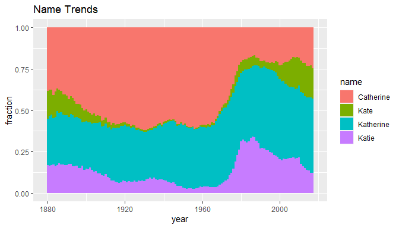
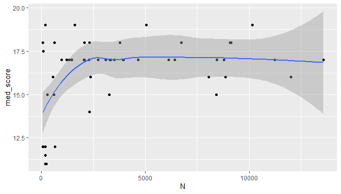
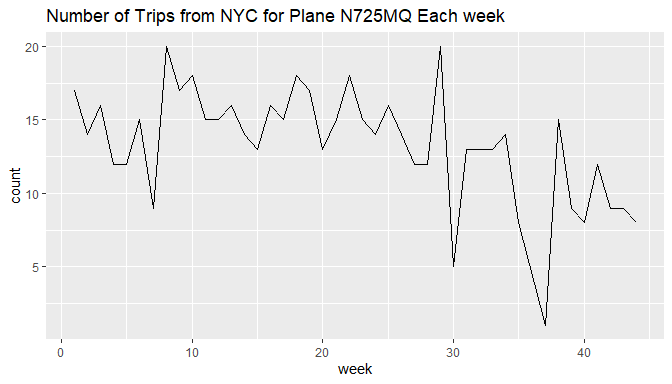

PS3 - solution
================

Push your knitted homework assignment (.Rmd, .md docs, and any other
required files or folders) to GitHub by the given deadline.

Package versions

``` r
> mypacks
[1] "ggplot2"      "babynames"    "dplyr"        "nycflights13" "lubridate"   
[6] "Lahman"       "mdsr"        
> lapply(mypacks, packageVersion)
[[1]]
[1] '3.3.6'

[[2]]
[1] '1.0.1'

[[3]]
[1] '1.0.10'

[[4]]
[1] '1.0.2'

[[5]]
[1] '1.8.0'

[[6]]
[1] '10.0.1'

[[7]]
[1] '0.2.6'
```

### Problem 1: explain command (no R needed)

Consider the data set shown in the table below. Each row represents a
class and `classType` of `S` denotes a statistics class and `C` denotes
a CS class. The variable `m` counts the number of mac users in the class
and `w` counts the number of windows users.

| classType | m   | w   |
|-----------|-----|-----|
| C         | 10  | 4   |
| C         | 3   | 1   |
| C         | 7   | 3   |
| S         | 2   | 7   |
| S         | 7   | 10  |

What data set will be produced by the following commands? Describe the
data set in words and show what it looks like using an R Markdown table
(like the one used above) to display the new data set. Assume the
original data set is named `mydata`.

**1.**

``` r
> mydata %>% 
+   filter(classType == "C") %>%
+   select(w,m)
```

*answer: 1.* This data set only looks at the number of mac/windows users
in CS classes.

| w   | m   |
|-----|-----|
| 4   | 10  |
| 1   | 3   |
| 3   | 7   |

**2.**

``` r
> mydata %>% 
+   mutate(ratioW = w/sum(w))
```

*answer: 2.* The `sum(w)` denominator equals 25, so the ratios are 4/25,
1/25, etc. The value of 25 gives the total number of windows users in
all classes so `ratioW` records the proportion of all windows users who
are in a given class.

| classType | m   | w   | ratioW |
|-----------|-----|-----|--------|
| C         | 10  | 4   | 0.16   |
| C         | 3   | 1   | 0.04   |
| C         | 7   | 3   | 0.12   |
| S         | 2   | 7   | 0.28   |
| S         | 7   | 10  | 0.40   |

**3.**

``` r
> mydata %>% 
+   group_by(classType) %>%
+   mutate(ratioW = w/sum(w))
```

*answer: 3.* The `sum(w)` denominator equals the sum of `w` for each
`classType` group. The total for `C` classes is 8 windows users in all
CS classes listed and for `S` classes is 17 windows users in stats
classes. `ratioW` records the proportion of all windows users in a given
class type (CS or stats) who are in a specific class.

| classType | m   | w   | ratioW |
|-----------|-----|-----|--------|
| C         | 10  | 4   | 0.50   |
| C         | 3   | 1   | 0.125  |
| C         | 7   | 3   | 0.375  |
| S         | 2   | 7   | 0.412  |
| S         | 7   | 10  | 0.588  |

**4.**

``` r
> mydata %>% 
+   group_by(classType) %>%
+   summarize(Y = sum(w+m))
```

*answer: 4.* We are grouping by `classType` then summarizing the class
totals `w+m` with the `sum` function. This will produce a small data
frame that gives the total number of CS and stats students:

| classType | Y   |
|-----------|-----|
| C         | 28  |
| S         | 26  |

**5.**

``` r
> mydata %>% 
+   group_by(classType) %>%
+   mutate(X = w+m, Y = sum(w+m))
```

*answer: 5.* We are grouping by `classType` which will only effect the
output for any command that summarizes variables like `sum`. The
`mutate` command preserves the original data frame and adds the variable
`X` that records the total number of mac and windows users in a given
class (row). The `Y` variable sums the values of `X` for all entries in
each `classType` (grouping variable). These values are repeated (28 CS
students and 26 stats students) for all classes in each `classType`.

| classType | m   | w   | X   | Y   |
|-----------|-----|-----|-----|-----|
| C         | 10  | 4   | 14  | 28  |
| C         | 3   | 1   | 4   | 28  |
| C         | 7   | 3   | 10  | 28  |
| S         | 2   | 7   | 9   | 26  |
| S         | 7   | 10  | 17  | 26  |

### Problem 2: explain output (no R needed)

Consider the data set in given in Problem 1. Explain why the following
command (similar to parts 4 and 5) may not produce the intended output
as discussed in class.

``` r
> mydata %>% 
+   group_by(classType) %>%
+   summarize(X = w+m, Y = sum(w+m))
```

*answer:* The result of a summarize command used after a grouping
command should be one value per group. The value of `X` in the command
above gives a different total for each class (row) in the original data
set. These totals can’t be reduced down into `classType` values unless
another summarizing function (like `sum`) is applied to them.

### Problem 3 (give command, no R needed)

Consider the data set in given in Problem 1. Provide the `dplyr`
commands that will produce the following data frames:

**1.** Adds the proportion of windows users in each class to the
original data frame.

*answer: 1.*

``` r
> mydata %>%
+   mutate(propW = w/(w+m))
```

**2.** Gives the `classType` and the proportion of windows users amoung
all students within each `classType`.

*answer: 2.*

``` r
> mydata %>% 
+   group_by(classType) %>%
+   summarize(Y = sum(w)/sum(w+m))
```

### Problem 4: babynames

Use the `babynames` dataset (see day 6 activity) and `dplyr` to answer
the following:

**1.** Create a data set `babynames_Kat` that contains data only on
female babies named `Katherine`. What is the value of
`nrow(babynames_Kat)`? What does this value represent?

*answer: 1.*

``` r
> babynames_Kat <- babynames %>% 
+     filter(name == "Katherine",sex=="F")
> nrow(babynames_Kat)
[1] 138
```

There are 138 entries in this data set. This is how many years since
1880 that at least one female was named Katherine.

**2.** Repeat part **1**, but this time look for all female entries with
variations on Katherine: `Katherine`, `Catherine`, `Katie` or `Kate`.

*answer: 2.*

``` r
> babynames_Kat <- babynames %>% 
+     filter(name %in% c("Katie","Kate","Katherine","Catherine"),sex=="F")
> nrow(babynames_Kat)
[1] 552
```

There are 552 entries in this data set. This is the number of years that
at least one female was named Katherine plus the number of years that at
least one female was named Catherine plus the same quantities for the
other two names.

**3.** Using your data frame from part **2**, create one graph that
shows the how the relative proportion of each of these four names varies
over time. What trends do you notice?

*answer: 3.*

``` r
> ggplot(babynames_Kat, aes(x=year, y=n, fill=name)) + 
+   geom_bar(stat='identity',position="fill",width=1) + 
+   ggtitle("Name Trends") + 
+   ylab("fraction") 
```

<!-- -->

The relative popularity of `Catherine` increases until roughly 1970
until `Katie` and `Kate` start to overatke it. The relative popularity
of `Katherine` has stayed pretty constant over the years.

### Problem 5: restaurant violations

Exercise 4.17 (2nd Ed. 4.11). \*\*Note: The problem asks you to focus on
`Manhattan`. Use `dplyr` package and both `point` and `smooth`
geometries in your graph to see patterns between number of inspections
and median score. What pattern do you notice?

Hint: You’ll need to use na.rm=TRUE to compute the median or an
`na.omit()` command when wrangling the data. If you use `na.omit()`,
make sure you’ve `select`ed only the key variables needed in your
analysis. You don’t want to omit a row with an `NA` if it occurs in a
variable you aren’t using.

#### *answers:*

There is a positive relationship between number of inspections and the
median score up until about 2500 inspections. Perhaps this refelcts the
fact that zipcodes with many restaurants tend to care more about their
overall reputation as a restaraunt cluster vs zipcodes with only a few
restaurants.

``` r
> data(Violations, package="mdsr")
> Violations %>% 
+   filter(boro == "MANHATTAN") %>%  # omit rows with NA score
+   group_by(zipcode) %>%  
+   summarize(med_score=median(score, na.rm=TRUE), N=n()) %>% 
+   filter(N>=50) %>%   # at least 50 violations/zipcode
+   ggplot(aes(x=N,y=med_score)) + 
+   geom_point() + 
+   geom_smooth()
```

<!-- -->

### Problem 6: flights

MDSR Exercise 4.3 (2nd Ed. 4.14)

Hint: You’ll need to use some date functions from the `lubridate`
package to create a variable for `week`.

#### *answers:*

``` r
> p8 <- flights %>% 
+   group_by(tailnum) %>% 
+   summarize(N=n()) %>% 
+   arrange(desc(N)) %>%
+   print(n=5)
# A tibble: 4,044 × 2
  tailnum     N
  <chr>   <int>
1 <NA>     2512
2 N725MQ    575
3 N722MQ    513
4 N723MQ    507
5 N711MQ    486
# … with 4,039 more rows
```

Flight tail number N725MQ has the most flights from NYC airports in 2013
with 575 flights.

``` r
> weekly_flights <- flights %>% filter(tailnum %in% p8[2,1]) %>%
+   mutate(week=week(time_hour)) %>%
+   group_by(week) %>%
+   summarize (count=sum(n()))
> 
> ggplot(weekly_flights, aes(x=week,y=count)) + geom_line() + 
+   labs(title=paste0("Number of Trips from NYC for Plane ",p8[2,1]," Each week"))
```

<!-- -->

### Problem 7: baseball

MDSR Exercise 4.11 (2nd Ed. 4.13). Use the `Lahman` package. The
datasets you will need is `Teams`.

#### *answers:*

The table below shows the 10 most succesful seasons for The Angels. They
won the world series in their second best season 2002.

``` r
> Teams %>% filter(teamIDBR %in% c("CAL","ANA","LAA")) %>%
+   select(yearID,W,G,WSWin) %>%
+   mutate(win_pct=W/G) %>%
+   arrange(desc(win_pct)) %>% 
+   head(10)
   yearID   W   G WSWin   win_pct
1    2008 100 162     N 0.6172840
2    2002  99 162     Y 0.6111111
3    2014  98 162     N 0.6049383
4    2009  97 162     N 0.5987654
5    2005  95 162     N 0.5864198
6    2007  94 162     N 0.5802469
7    1982  93 162     N 0.5740741
8    1986  92 162     N 0.5679012
9    2004  92 162     N 0.5679012
10   1989  91 162     N 0.5617284
```

It’s unlikely that The Angels won a world series outside their top 10
seasons but the following code checks just in case. It shows that indeed
they only won the World Series once.

``` r
> Teams %>% filter(teamIDBR %in% c("CAL","ANA","LAA")) %>%
+   select(WSWin) %>% 
+   na.omit() %>%
+   mutate(anywin=(WSWin=="Y")) %>% 
+   summary(anywin)
    WSWin             anywin       
 Length:60          Mode :logical  
 Class :character   FALSE:59       
 Mode  :character   TRUE :1        
```
