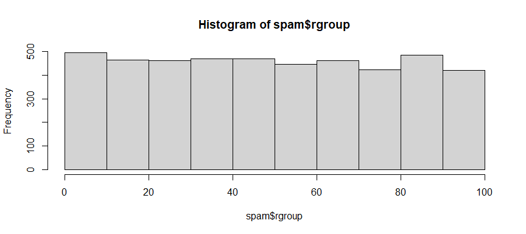
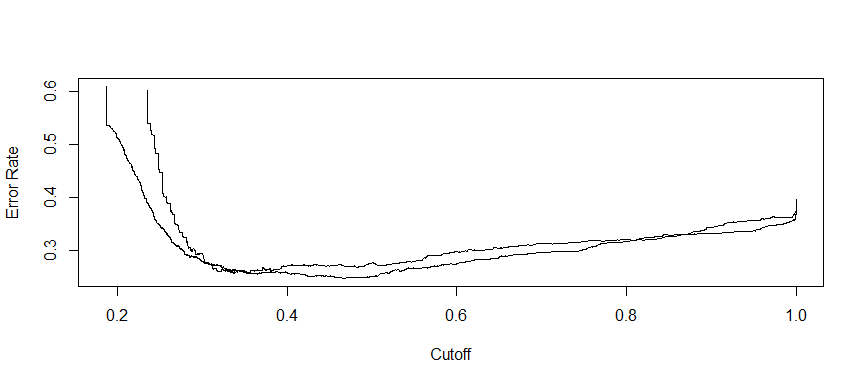
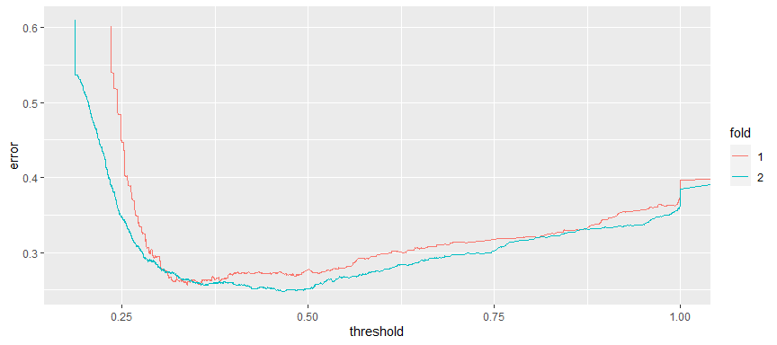

Cross validation
================
ECON 122
Day 15

This example looks at a data set of about 4600 emails that are
classified as spam or not spam, along with over 50 variables measuring
different characteristic of the email. Details about these variables are
found on the [Spambase
example](http://archive.ics.uci.edu/ml/datasets/Spambase) on the machine
learning data archive. The dataset linked to below is a slightly cleaned
up version of this data. The only extra column in the data is `rgroup`
which is a randomly assigned grouping variable (groups 0 through 99).

Read the data in

``` r
> # tsv = tab separated values!
> spam <- read_delim("https://raw.githubusercontent.com/mgelman/data/master/spamD.txt", delim="\t", col_types = cols(spam = col_factor(levels=c("non-spam","spam")), .default = col_double()))
> glimpse(spam)
Rows: 4,601
Columns: 59
$ word.freq.make             <dbl> 0.00, 0.21, 0.06, 0.00, 0.00, 0.00, 0.00, 0~
$ word.freq.address          <dbl> 0.64, 0.28, 0.00, 0.00, 0.00, 0.00, 0.00, 0~
$ word.freq.all              <dbl> 0.64, 0.50, 0.71, 0.00, 0.00, 0.00, 0.00, 0~
$ word.freq.3d               <dbl> 0, 0, 0, 0, 0, 0, 0, 0, 0, 0, 0, 0, 0, 0, 0~
$ word.freq.our              <dbl> 0.32, 0.14, 1.23, 0.63, 0.63, 1.85, 1.92, 1~
$ word.freq.over             <dbl> 0.00, 0.28, 0.19, 0.00, 0.00, 0.00, 0.00, 0~
$ word.freq.remove           <dbl> 0.00, 0.21, 0.19, 0.31, 0.31, 0.00, 0.00, 0~
$ word.freq.internet         <dbl> 0.00, 0.07, 0.12, 0.63, 0.63, 1.85, 0.00, 1~
$ word.freq.order            <dbl> 0.00, 0.00, 0.64, 0.31, 0.31, 0.00, 0.00, 0~
$ word.freq.mail             <dbl> 0.00, 0.94, 0.25, 0.63, 0.63, 0.00, 0.64, 0~
$ word.freq.receive          <dbl> 0.00, 0.21, 0.38, 0.31, 0.31, 0.00, 0.96, 0~
$ word.freq.will             <dbl> 0.64, 0.79, 0.45, 0.31, 0.31, 0.00, 1.28, 0~
$ word.freq.people           <dbl> 0.00, 0.65, 0.12, 0.31, 0.31, 0.00, 0.00, 0~
$ word.freq.report           <dbl> 0.00, 0.21, 0.00, 0.00, 0.00, 0.00, 0.00, 0~
$ word.freq.addresses        <dbl> 0.00, 0.14, 1.75, 0.00, 0.00, 0.00, 0.00, 0~
$ word.freq.free             <dbl> 0.32, 0.14, 0.06, 0.31, 0.31, 0.00, 0.96, 0~
$ word.freq.business         <dbl> 0.00, 0.07, 0.06, 0.00, 0.00, 0.00, 0.00, 0~
$ word.freq.email            <dbl> 1.29, 0.28, 1.03, 0.00, 0.00, 0.00, 0.32, 0~
$ word.freq.you              <dbl> 1.93, 3.47, 1.36, 3.18, 3.18, 0.00, 3.85, 0~
$ word.freq.credit           <dbl> 0.00, 0.00, 0.32, 0.00, 0.00, 0.00, 0.00, 0~
$ word.freq.your             <dbl> 0.96, 1.59, 0.51, 0.31, 0.31, 0.00, 0.64, 0~
$ word.freq.font             <dbl> 0, 0, 0, 0, 0, 0, 0, 0, 0, 0, 0, 0, 0, 0, 0~
$ word.freq.000              <dbl> 0.00, 0.43, 1.16, 0.00, 0.00, 0.00, 0.00, 0~
$ word.freq.money            <dbl> 0.00, 0.43, 0.06, 0.00, 0.00, 0.00, 0.00, 0~
$ word.freq.hp               <dbl> 0, 0, 0, 0, 0, 0, 0, 0, 0, 0, 0, 0, 0, 0, 0~
$ word.freq.hpl              <dbl> 0, 0, 0, 0, 0, 0, 0, 0, 0, 0, 0, 0, 0, 0, 0~
$ word.freq.george           <dbl> 0, 0, 0, 0, 0, 0, 0, 0, 0, 0, 0, 0, 0, 0, 0~
$ word.freq.650              <dbl> 0.00, 0.00, 0.00, 0.00, 0.00, 0.00, 0.00, 0~
$ word.freq.lab              <dbl> 0, 0, 0, 0, 0, 0, 0, 0, 0, 0, 0, 0, 0, 0, 0~
$ word.freq.labs             <dbl> 0, 0, 0, 0, 0, 0, 0, 0, 0, 0, 0, 0, 0, 0, 0~
$ word.freq.telnet           <dbl> 0, 0, 0, 0, 0, 0, 0, 0, 0, 0, 0, 0, 0, 0, 0~
$ word.freq.857              <dbl> 0, 0, 0, 0, 0, 0, 0, 0, 0, 0, 0, 0, 0, 0, 0~
$ word.freq.data             <dbl> 0.00, 0.00, 0.00, 0.00, 0.00, 0.00, 0.00, 0~
$ word.freq.415              <dbl> 0, 0, 0, 0, 0, 0, 0, 0, 0, 0, 0, 0, 0, 0, 0~
$ word.freq.85               <dbl> 0, 0, 0, 0, 0, 0, 0, 0, 0, 0, 0, 0, 0, 0, 0~
$ word.freq.technology       <dbl> 0.00, 0.00, 0.00, 0.00, 0.00, 0.00, 0.00, 0~
$ word.freq.1999             <dbl> 0.00, 0.07, 0.00, 0.00, 0.00, 0.00, 0.00, 0~
$ word.freq.parts            <dbl> 0, 0, 0, 0, 0, 0, 0, 0, 0, 0, 0, 0, 0, 0, 0~
$ word.freq.pm               <dbl> 0, 0, 0, 0, 0, 0, 0, 0, 0, 0, 0, 0, 0, 0, 0~
$ word.freq.direct           <dbl> 0.00, 0.00, 0.06, 0.00, 0.00, 0.00, 0.00, 0~
$ word.freq.cs               <dbl> 0, 0, 0, 0, 0, 0, 0, 0, 0, 0, 0, 0, 0, 0, 0~
$ word.freq.meeting          <dbl> 0, 0, 0, 0, 0, 0, 0, 0, 0, 0, 0, 0, 0, 0, 0~
$ word.freq.original         <dbl> 0.00, 0.00, 0.12, 0.00, 0.00, 0.00, 0.00, 0~
$ word.freq.project          <dbl> 0.00, 0.00, 0.00, 0.00, 0.00, 0.00, 0.00, 0~
$ word.freq.re               <dbl> 0.00, 0.00, 0.06, 0.00, 0.00, 0.00, 0.00, 0~
$ word.freq.edu              <dbl> 0.00, 0.00, 0.06, 0.00, 0.00, 0.00, 0.00, 0~
$ word.freq.table            <dbl> 0, 0, 0, 0, 0, 0, 0, 0, 0, 0, 0, 0, 0, 0, 0~
$ word.freq.conference       <dbl> 0, 0, 0, 0, 0, 0, 0, 0, 0, 0, 0, 0, 0, 0, 0~
$ char.freq.semi             <dbl> 0.000, 0.000, 0.010, 0.000, 0.000, 0.000, 0~
$ char.freq.lparen           <dbl> 0.000, 0.132, 0.143, 0.137, 0.135, 0.223, 0~
$ char.freq.lbrack           <dbl> 0.000, 0.000, 0.000, 0.000, 0.000, 0.000, 0~
$ char.freq.bang             <dbl> 0.778, 0.372, 0.276, 0.137, 0.135, 0.000, 0~
$ char.freq.dollar           <dbl> 0.000, 0.180, 0.184, 0.000, 0.000, 0.000, 0~
$ char.freq.hash             <dbl> 0.000, 0.048, 0.010, 0.000, 0.000, 0.000, 0~
$ capital.run.length.average <dbl> 3.756, 5.114, 9.821, 3.537, 3.537, 3.000, 1~
$ capital.run.length.longest <dbl> 61, 101, 485, 40, 40, 15, 4, 11, 445, 43, 6~
$ capital.run.length.total   <dbl> 278, 1028, 2259, 191, 191, 54, 112, 49, 125~
$ spam                       <fct> spam, spam, spam, spam, spam, spam, spam, s~
$ rgroup                     <dbl> 52, 91, 49, 88, 73, 45, 93, 10, 60, 75, 90,~
```

#### Question 1:

What proportion of these emails are labled as spam?

### 1. Fit large model

First fit a model will all 57 predictors. Rather than write out this
*huge* equation, you can paste it together and run the string through
the `as.formula` function:

``` r
> names(spam)
 [1] "word.freq.make"             "word.freq.address"         
 [3] "word.freq.all"              "word.freq.3d"              
 [5] "word.freq.our"              "word.freq.over"            
 [7] "word.freq.remove"           "word.freq.internet"        
 [9] "word.freq.order"            "word.freq.mail"            
[11] "word.freq.receive"          "word.freq.will"            
[13] "word.freq.people"           "word.freq.report"          
[15] "word.freq.addresses"        "word.freq.free"            
[17] "word.freq.business"         "word.freq.email"           
[19] "word.freq.you"              "word.freq.credit"          
[21] "word.freq.your"             "word.freq.font"            
[23] "word.freq.000"              "word.freq.money"           
[25] "word.freq.hp"               "word.freq.hpl"             
[27] "word.freq.george"           "word.freq.650"             
[29] "word.freq.lab"              "word.freq.labs"            
[31] "word.freq.telnet"           "word.freq.857"             
[33] "word.freq.data"             "word.freq.415"             
[35] "word.freq.85"               "word.freq.technology"      
[37] "word.freq.1999"             "word.freq.parts"           
[39] "word.freq.pm"               "word.freq.direct"          
[41] "word.freq.cs"               "word.freq.meeting"         
[43] "word.freq.original"         "word.freq.project"         
[45] "word.freq.re"               "word.freq.edu"             
[47] "word.freq.table"            "word.freq.conference"      
[49] "char.freq.semi"             "char.freq.lparen"          
[51] "char.freq.lbrack"           "char.freq.bang"            
[53] "char.freq.dollar"           "char.freq.hash"            
[55] "capital.run.length.average" "capital.run.length.longest"
[57] "capital.run.length.total"   "spam"                      
[59] "rgroup"                    
> xvars <- str_c(names(spam)[1:57], collapse="+")
> xvars
[1] "word.freq.make+word.freq.address+word.freq.all+word.freq.3d+word.freq.our+word.freq.over+word.freq.remove+word.freq.internet+word.freq.order+word.freq.mail+word.freq.receive+word.freq.will+word.freq.people+word.freq.report+word.freq.addresses+word.freq.free+word.freq.business+word.freq.email+word.freq.you+word.freq.credit+word.freq.your+word.freq.font+word.freq.000+word.freq.money+word.freq.hp+word.freq.hpl+word.freq.george+word.freq.650+word.freq.lab+word.freq.labs+word.freq.telnet+word.freq.857+word.freq.data+word.freq.415+word.freq.85+word.freq.technology+word.freq.1999+word.freq.parts+word.freq.pm+word.freq.direct+word.freq.cs+word.freq.meeting+word.freq.original+word.freq.project+word.freq.re+word.freq.edu+word.freq.table+word.freq.conference+char.freq.semi+char.freq.lparen+char.freq.lbrack+char.freq.bang+char.freq.dollar+char.freq.hash+capital.run.length.average+capital.run.length.longest+capital.run.length.total"
> myform <- as.formula(str_c("spam ~ ", xvars))
> myform
spam ~ word.freq.make + word.freq.address + word.freq.all + word.freq.3d + 
    word.freq.our + word.freq.over + word.freq.remove + word.freq.internet + 
    word.freq.order + word.freq.mail + word.freq.receive + word.freq.will + 
    word.freq.people + word.freq.report + word.freq.addresses + 
    word.freq.free + word.freq.business + word.freq.email + word.freq.you + 
    word.freq.credit + word.freq.your + word.freq.font + word.freq.000 + 
    word.freq.money + word.freq.hp + word.freq.hpl + word.freq.george + 
    word.freq.650 + word.freq.lab + word.freq.labs + word.freq.telnet + 
    word.freq.857 + word.freq.data + word.freq.415 + word.freq.85 + 
    word.freq.technology + word.freq.1999 + word.freq.parts + 
    word.freq.pm + word.freq.direct + word.freq.cs + word.freq.meeting + 
    word.freq.original + word.freq.project + word.freq.re + word.freq.edu + 
    word.freq.table + word.freq.conference + char.freq.semi + 
    char.freq.lparen + char.freq.lbrack + char.freq.bang + char.freq.dollar + 
    char.freq.hash + capital.run.length.average + capital.run.length.longest + 
    capital.run.length.total
```

The use this formula in your `glm`:

``` r
> myglm <- glm(myform, data= spam, family="binomial")
Warning: glm.fit: fitted probabilities numerically 0 or 1 occurred
> summary(myglm)

Call:
glm(formula = myform, family = "binomial", data = spam)

Deviance Residuals: 
   Min      1Q  Median      3Q     Max  
-4.127  -0.203   0.000   0.114   5.364  

Coefficients:
                             Estimate Std. Error z value Pr(>|z|)    
(Intercept)                -1.569e+00  1.420e-01 -11.044  < 2e-16 ***
word.freq.make             -3.895e-01  2.315e-01  -1.683 0.092388 .  
word.freq.address          -1.458e-01  6.928e-02  -2.104 0.035362 *  
word.freq.all               1.141e-01  1.103e-01   1.035 0.300759    
word.freq.3d                2.252e+00  1.507e+00   1.494 0.135168    
word.freq.our               5.624e-01  1.018e-01   5.524 3.31e-08 ***
word.freq.over              8.830e-01  2.498e-01   3.534 0.000409 ***
word.freq.remove            2.279e+00  3.328e-01   6.846 7.57e-12 ***
word.freq.internet          5.696e-01  1.682e-01   3.387 0.000707 ***
word.freq.order             7.343e-01  2.849e-01   2.577 0.009958 ** 
word.freq.mail              1.275e-01  7.262e-02   1.755 0.079230 .  
word.freq.receive          -2.557e-01  2.979e-01  -0.858 0.390655    
word.freq.will             -1.383e-01  7.405e-02  -1.868 0.061773 .  
word.freq.people           -7.961e-02  2.303e-01  -0.346 0.729557    
word.freq.report            1.447e-01  1.364e-01   1.061 0.288855    
word.freq.addresses         1.236e+00  7.254e-01   1.704 0.088370 .  
word.freq.free              1.039e+00  1.457e-01   7.128 1.01e-12 ***
word.freq.business          9.599e-01  2.251e-01   4.264 2.01e-05 ***
word.freq.email             1.203e-01  1.172e-01   1.027 0.304533    
word.freq.you               8.131e-02  3.505e-02   2.320 0.020334 *  
word.freq.credit            1.047e+00  5.383e-01   1.946 0.051675 .  
word.freq.your              2.419e-01  5.243e-02   4.615 3.94e-06 ***
word.freq.font              2.013e-01  1.627e-01   1.238 0.215838    
word.freq.000               2.245e+00  4.714e-01   4.762 1.91e-06 ***
word.freq.money             4.264e-01  1.621e-01   2.630 0.008535 ** 
word.freq.hp               -1.920e+00  3.128e-01  -6.139 8.31e-10 ***
word.freq.hpl              -1.040e+00  4.396e-01  -2.366 0.017966 *  
word.freq.george           -1.177e+01  2.113e+00  -5.569 2.57e-08 ***
word.freq.650               4.454e-01  1.991e-01   2.237 0.025255 *  
word.freq.lab              -2.486e+00  1.502e+00  -1.656 0.097744 .  
word.freq.labs             -3.299e-01  3.137e-01  -1.052 0.292972    
word.freq.telnet           -1.702e-01  4.815e-01  -0.353 0.723742    
word.freq.857               2.549e+00  3.283e+00   0.776 0.437566    
word.freq.data             -7.383e-01  3.117e-01  -2.369 0.017842 *  
word.freq.415               6.679e-01  1.601e+00   0.417 0.676490    
word.freq.85               -2.055e+00  7.883e-01  -2.607 0.009124 ** 
word.freq.technology        9.237e-01  3.091e-01   2.989 0.002803 ** 
word.freq.1999              4.651e-02  1.754e-01   0.265 0.790819    
word.freq.parts            -5.968e-01  4.232e-01  -1.410 0.158473    
word.freq.pm               -8.650e-01  3.828e-01  -2.260 0.023844 *  
word.freq.direct           -3.046e-01  3.636e-01  -0.838 0.402215    
word.freq.cs               -4.505e+01  2.660e+01  -1.694 0.090333 .  
word.freq.meeting          -2.689e+00  8.384e-01  -3.207 0.001342 ** 
word.freq.original         -1.247e+00  8.064e-01  -1.547 0.121978    
word.freq.project          -1.573e+00  5.292e-01  -2.973 0.002953 ** 
word.freq.re               -7.923e-01  1.556e-01  -5.091 3.56e-07 ***
word.freq.edu              -1.459e+00  2.686e-01  -5.434 5.52e-08 ***
word.freq.table            -2.326e+00  1.659e+00  -1.402 0.160958    
word.freq.conference       -4.016e+00  1.611e+00  -2.493 0.012672 *  
char.freq.semi             -1.291e+00  4.422e-01  -2.920 0.003503 ** 
char.freq.lparen           -1.881e-01  2.494e-01  -0.754 0.450663    
char.freq.lbrack           -6.574e-01  8.383e-01  -0.784 0.432914    
char.freq.bang              3.472e-01  8.926e-02   3.890 0.000100 ***
char.freq.dollar            5.336e+00  7.064e-01   7.553 4.24e-14 ***
char.freq.hash              2.403e+00  1.113e+00   2.159 0.030883 *  
capital.run.length.average  1.199e-02  1.884e-02   0.636 0.524509    
capital.run.length.longest  9.118e-03  2.521e-03   3.618 0.000297 ***
capital.run.length.total    8.437e-04  2.251e-04   3.747 0.000179 ***
---
Signif. codes:  0 '***' 0.001 '**' 0.01 '*' 0.05 '.' 0.1 ' ' 1

(Dispersion parameter for binomial family taken to be 1)

    Null deviance: 6170.2  on 4600  degrees of freedom
Residual deviance: 1815.8  on 4543  degrees of freedom
AIC: 1931.8

Number of Fisher Scoring iterations: 13
```

#### Question 2

Use the `cv.glm` function to find the 5-fold CV error for this model. Do
this twice using thresholds of 0.2 and 0.5. How do they change when
changing the threshold?

#### Question 3 - only try this if your computer is fast or you have lots of time!

Find the LOOCV error for a 0.5 threshold. How much longer does LOOCV
take to run compared to the 5-fold error? How similar or different are
the error values.

### 2. Fit smaller model

Let’s work with a smaller model for a while. Fit a `glm` just using the
three capital run length variables.

#### Question 4

What is the 5-fold CV error for this smaller model? How does it compare
the the error for the bigger model?

### 3. Doing 2-fold CV manually using the `ROCR` package

This question asks you to manually perform a 2-fold Cross Validation so
that you can better understand what is going on under the hood

The dataset contains random group assignments that we can use for
validation.

``` r
> hist(spam$rgroup)
```

<!-- -->

Here is one way to use these random group assignments to do 2-fold cross
validation. First we create a matrix with columns indicating whether a
case is in the fold (group) of interest:

``` r
> train_index <- cbind(spam$rgroup %in% 0:49, spam$rgroup%in% (50:99))
> head(train_index)
      [,1]  [,2]
[1,] FALSE  TRUE
[2,] FALSE  TRUE
[3,]  TRUE FALSE
[4,] FALSE  TRUE
[5,] FALSE  TRUE
[6,]  TRUE FALSE
```

Column 1 `TRUE`s indicate that the row is in the first fold
`training set` while a `FALSE` indicates that it is in the first fold
`test set`. Similar for column 2.

Now we will use an `lapply` command to get the probabilities for the two
training sets

``` r
> xvars2 <- str_c(names(spam)[55:57], collapse="+")
> myform2 <- as.formula(str_c("spam ~ ", xvars2))
> probs_train <- lapply(1:2, 
+                       FUN= function(x){
+                     predict(glm(myform2,spam[train_index[,x],],family="binomial"), type="response")
+                         } )
Warning: glm.fit: fitted probabilities numerically 0 or 1 occurred

Warning: glm.fit: fitted probabilities numerically 0 or 1 occurred
> str(probs_train)
List of 2
 $ : Named num [1:2309] 1 0.302 0.282 0.281 0.262 ...
  ..- attr(*, "names")= chr [1:2309] "1" "2" "3" "4" ...
 $ : Named num [1:2292] 0.538 0.767 0.44 0.44 0.222 ...
  ..- attr(*, "names")= chr [1:2292] "1" "2" "3" "4" ...
```

We can use another `lapply` command to get a logical vector of responses
for the two training sets. We then put the list of two probability
vectors and list of two response vectors into the `prediction` command
and then use `performance` to get the CV error computed for a range of
threshold (cutoff) values.

``` r
> y_train <- lapply(1:2, FUN=function(x){spam$spam[train_index[,x]] == "spam"})
> pred_obj_train <- prediction(probs_train, y_train)
> perf_obj_train <- performance(pred_obj_train, "err")
> str(perf_obj_train)
Formal class 'performance' [package "ROCR"] with 6 slots
  ..@ x.name      : chr "Cutoff"
  ..@ y.name      : chr "Error Rate"
  ..@ alpha.name  : chr "none"
  ..@ x.values    :List of 2
  .. ..$ : Named num [1:1926] Inf 1 1 1 1 ...
  .. .. ..- attr(*, "names")= chr [1:1926] "" "1024" "248" "215" ...
  .. ..$ : Named num [1:1919] Inf 1 1 1 1 ...
  .. .. ..- attr(*, "names")= chr [1:1919] "" "862" "425" "571" ...
  ..@ y.values    :List of 2
  .. ..$ : num [1:1926] 0.398 0.397 0.396 0.396 0.395 ...
  .. ..$ : num [1:1919] 0.39 0.384 0.384 0.384 0.383 ...
  ..@ alpha.values: list()
```

We can plot the performance object based on the two training set error
rates.

``` r
> plot(perf_obj_train)
```

<!-- -->

#### Question 5

Repeat the work above for the test set. Remember that you need to use
the training data to fit the model but the test data to compute
probabilities.

### 4. Making performance lists into data frames

To do any analysis of the performance results we need to take the lists
and create data frames. Here is a function that can do that for the
error performance objects that you should have for the test and training
sets.

``` r
> clean_up_err <- function(perf)
+ { ns <- sapply(1:2, function(x){length(perf@x.values[[x]])})
+   fold <- unlist(lapply(1:2, function(x){rep(x,ns[x])}))
+   threshold <- unlist(perf@x.values)
+   error <- unlist(perf@y.values)
+   return(data_frame(threshold = threshold, error=error, fold = as.character(fold)) )
+ }
> train_df <- clean_up_err(perf_obj_train)
Warning: `data_frame()` was deprecated in tibble 1.1.0.
Please use `tibble()` instead.
This warning is displayed once every 8 hours.
Call `lifecycle::last_lifecycle_warnings()` to see where this warning was generated.
> train_df
# A tibble: 3,845 x 3
   threshold error fold 
       <dbl> <dbl> <chr>
 1    Inf    0.398 1    
 2      1    0.397 1    
 3      1.00 0.396 1    
 4      1.00 0.396 1    
 5      1.00 0.395 1    
 6      1.00 0.395 1    
 7      1.00 0.395 1    
 8      1.00 0.394 1    
 9      1.00 0.394 1    
10      1.00 0.393 1    
# ... with 3,835 more rows
> train_df <- train_df %>% mutate(name = "train")
> ggplot(train_df, aes(x=threshold, y=error, color=fold)) + geom_line()
```

<!-- -->

#### Question 6

Repeat the work above for the test set so you have training and test set
data frames. Then bind these data frames together and create one ggplot
showing the four error lines for each combination of fold and type of
data (test vs. train). Comment on any similarities or differents between
the type and fold.
