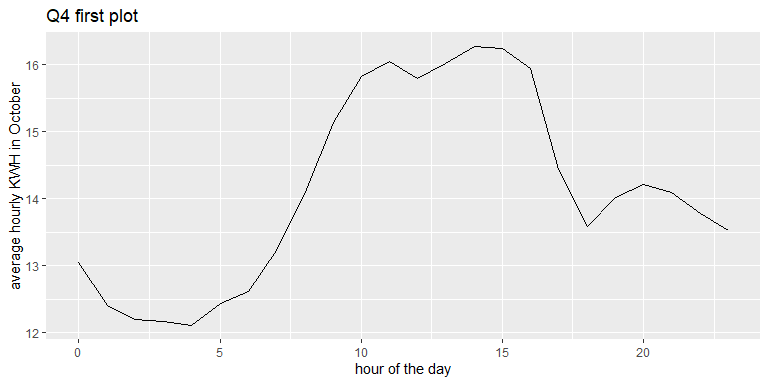
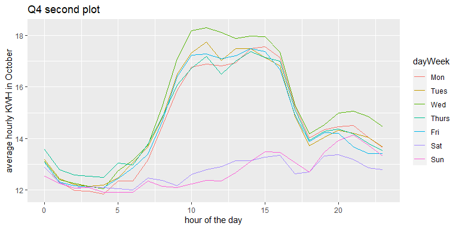
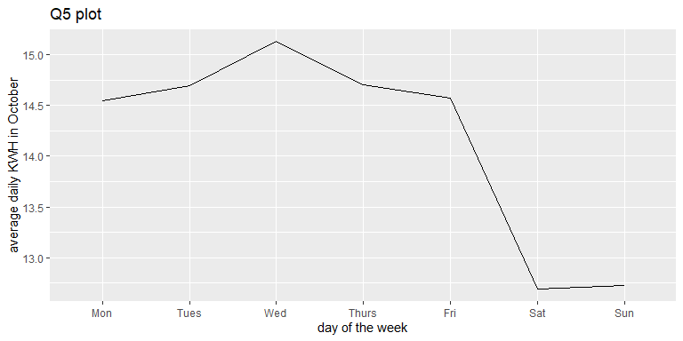
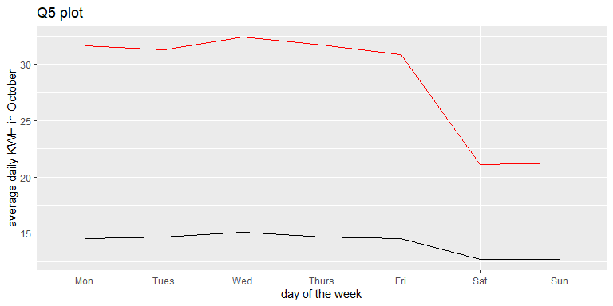
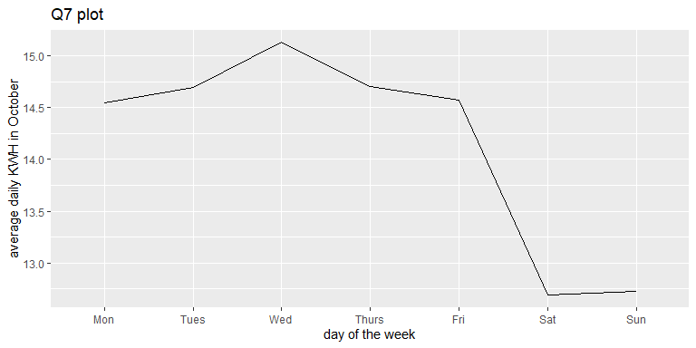
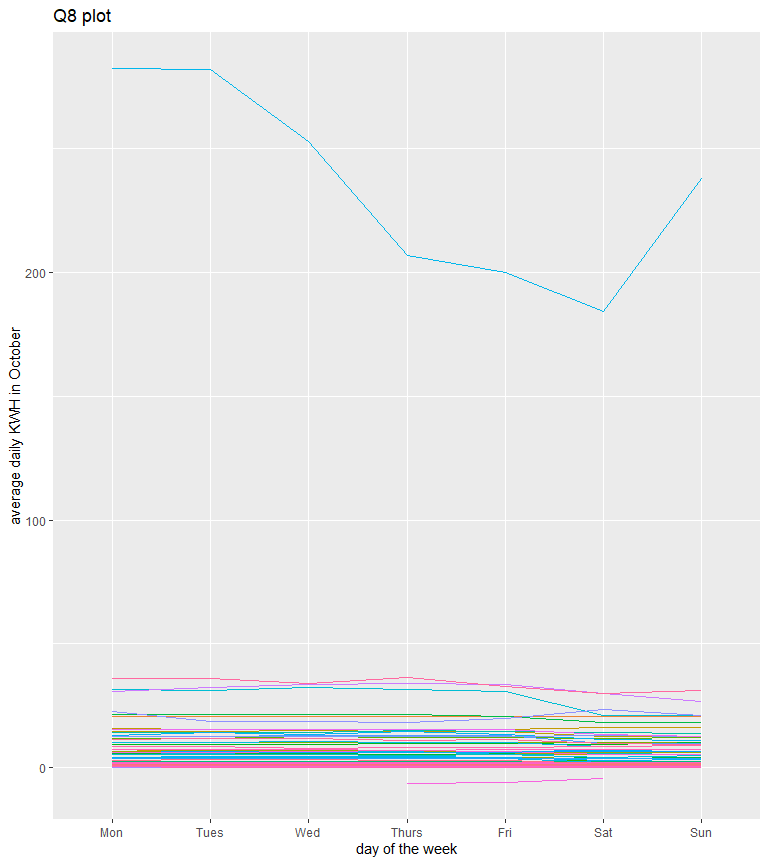
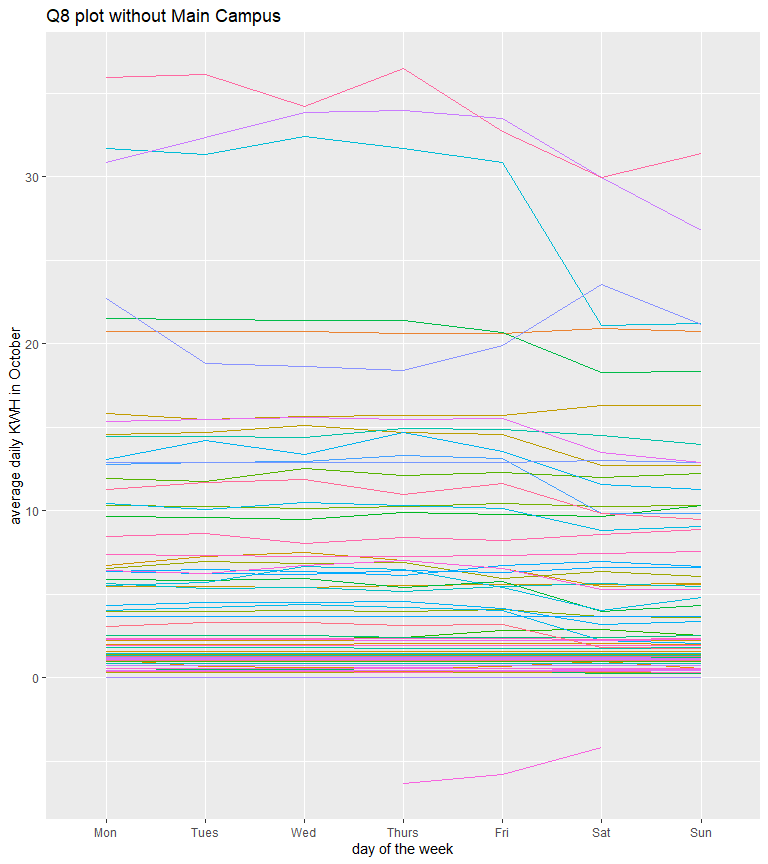
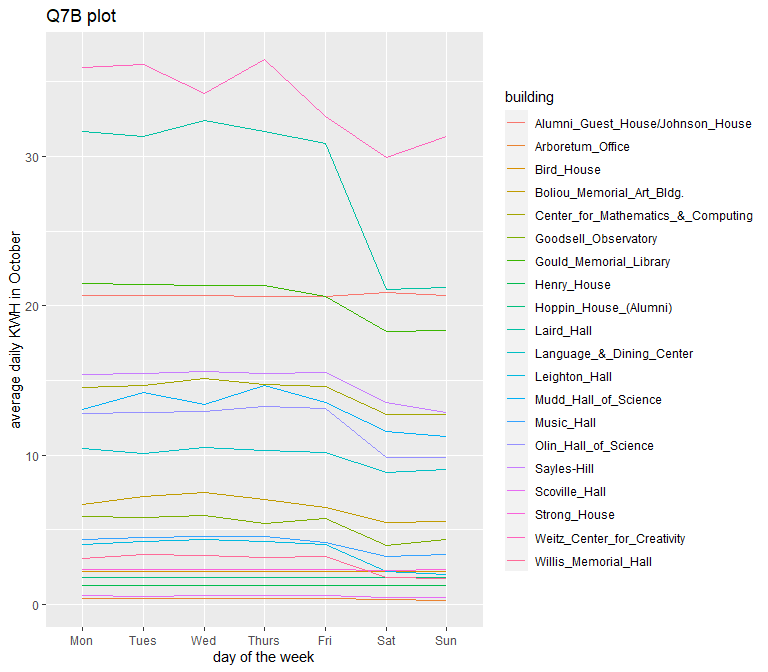
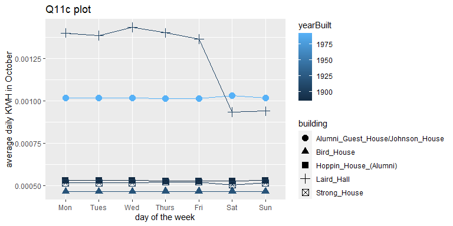

Tidy data: Carleton College Energy Activity - Solution
================
ECON 122
Day 8,9

The data for this example is from Carleton College. The goal of this
activity is to help you better understand what issues arrive from
working with real world data.

# Building Data

The `AAbuildings` dataset gives the size and year built of buildings on
campus that are considered academic or administrative buildings.

### Question 1

**1.** Run the two read commands below (`read.csv` and
`readr::read_csv`). How do they read in the data differently?

**2.** How many buildings on campus are classified as academic or
administrative?

``` r
> AAbuildings <- read.csv("https://raw.githubusercontent.com/mgelman/data/master/AcadAdminBuildings.csv",stringsAsFactors=TRUE)
> glimpse(AAbuildings)
Rows: 25
Columns: 4
$ building <fct> 200_Division_Street_Building, 212_East_2nd_St., 216_College_S…
$ Address  <fct> 200 Division St., 212 East 2nd St., 216 College St. S., 100 C…
$ year     <dbl> 1948, 1947, 1894, 1992, 1989, 1920, 1950, 1993, 1910, 1888, 1…
$ sqFt     <dbl> 21147, 3276, 4017, 20337, 2952, 4780, 30547, 42300, 33104, 11…
> AAbuildings <- read_csv("https://raw.githubusercontent.com/mgelman/data/master/AcadAdminBuildings.csv")
> glimpse(AAbuildings)
Rows: 25
Columns: 4
$ building <chr> "200_Division_Street_Building", "212_East_2nd_St.", "216_Coll…
$ Address  <chr> "200 Division St.", "212 East 2nd St.", "216 College St. S.",…
$ year     <dbl> 1948, 1947, 1894, 1992, 1989, 1920, 1950, 1993, 1910, 1888, 1…
$ sqFt     <dbl> 21147, 3276, 4017, 20337, 2952, 4780, 30547, 42300, 33104, 11…
```

#### *Answer:*

**1.** `read.csv` defaults to factor variables for anything with
characters while `read_csv` defaults to character variables. **2.**
There are 25 rows in the data set so that is the number of acad/admin
buildings.

# Energy Use Data

A second dataset gives energy use (kiloWatt hour) every 15 minutes for
the 15-16 academic year for all buildings on campus that have an energy
meter installed.

### Question 2

**1.** How have the variable types changed when using `read_csv` instead
of `read.csv`? - e.g. look at Musser, Timestamp

``` r
> energy1 <- read.csv("https://raw.githubusercontent.com/mgelman/data/master/EnergyData1516.csv")
> glimpse(energy1)
Rows: 35,129
Columns: 90
$ Timestamp                          <chr> "2015-09-01 00:00:00", "2015-09-01 …
$ year                               <int> 2015, 2015, 2015, 2015, 2015, 2015,…
$ month                              <int> 9, 9, 9, 9, 9, 9, 9, 9, 9, 9, 9, 9,…
$ weekOfYear                         <int> 35, 35, 35, 35, 35, 35, 35, 35, 35,…
$ dayOfMonth                         <int> 1, 1, 1, 1, 1, 1, 1, 1, 1, 1, 1, 1,…
$ dayWeek                            <chr> "Tues", "Tues", "Tues", "Tues", "Tu…
$ timeHour                           <int> 0, 0, 0, 0, 1, 1, 1, 1, 2, 2, 2, 2,…
$ timeMinute                         <int> 0, 15, 30, 45, 0, 15, 30, 45, 0, 15…
$ X100_Nevada_Street                 <dbl> 0.18333, NA, NA, NA, 0.18333, NA, N…
$ X104_Maple_St.                     <dbl> 1.42361, NA, NA, NA, 1.42361, NA, N…
$ X106_Winona_St.                    <dbl> 1.10278, NA, NA, NA, 1.10278, NA, N…
$ Allen_House                        <dbl> 1.51172, NA, NA, NA, 1.51172, NA, N…
$ Alumni_Guest_House.Johnson_House   <dbl> 18.4375, NA, NA, NA, 18.4375, NA, N…
$ Arboretum_Office                   <dbl> 0.27, 0.24, 0.28, 0.46, 0.27, 0.24,…
$ Art_Studios                        <dbl> 0.40, 0.38, 0.29, 0.34, 0.84, 0.50,…
$ Benton_House                       <dbl> 2.26528, NA, NA, NA, 2.26528, NA, N…
$ Berg_House                         <dbl> 1.56389, NA, NA, NA, 1.56389, NA, N…
$ Bird_House                         <dbl> 2.93194, NA, NA, NA, 2.93194, NA, N…
$ Boliou_Memorial_Art_Bldg.          <dbl> 4.5313, 4.5312, 4.5313, 4.3750, 4.3…
$ Burton_Hall                        <dbl> 5, 4, 5, 4, 4, 4, 3, 4, 4, 4, 4, 4,…
$ Cassat_Hall_._James_Hall           <dbl> 13.00, 12.25, 12.75, 12.25, 12.00, …
$ Center_for_Mathematics_._Computing <dbl> 14.3750, 14.0625, 14.3750, 14.0625,…
$ Chaney_House                       <dbl> 1.08194, NA, NA, NA, 1.08194, NA, N…
$ Clader_House                       <dbl> 0.22917, NA, NA, NA, 0.22917, NA, N…
$ College_Warehouse                  <dbl> 0.93, 0.96, 0.69, 1.10, 0.98, 0.76,…
$ Cowling_Gym                        <dbl> 6, 7, 6, 6, 6, 6, 6, 6, 6, 6, 6, 6,…
$ Dacie_Moses_House                  <dbl> 1.46944, NA, NA, NA, 1.46944, NA, N…
$ Davis_Hall                         <dbl> 3, 3, 3, 3, 3, 2, 4, 3, 3, 2, 3, 2,…
$ Douglas_House                      <dbl> 0.66389, NA, NA, NA, 0.66389, NA, N…
$ Evans_Hall                         <dbl> 9.88, 9.00, 9.00, 8.75, 8.75, 9.12,…
$ Faculty_Club_._Annex               <dbl> 0, 0, 0, 0, 0, 0, 0, 0, 0, 0, 0, 0,…
$ Farm_House                         <dbl> 12, 12, 11, 12, 12, 11, 12, 13, 11,…
$ Geffert_House                      <dbl> 0.90755, NA, NA, NA, 0.90755, NA, N…
$ Generator_Building                 <dbl> 1.46, 1.68, 0.64, 2.04, 1.46, 0.83,…
$ Goodhue_Hall                       <dbl> 7, 7, 7, 7, 6, 7, 7, 6, 7, 6, 6, 7,…
$ Goodsell_Observatory               <dbl> 6, 5, 4, 5, 5, 5, 4, 5, 5, 5, 4, 5,…
$ Gould_Memorial_Library             <dbl> 9, 10, 10, 9, 9, 9, 9, 9, 9, 8, 9, …
$ Grounds_Building                   <dbl> 0.35, 0.36, 0.37, 0.36, 0.37, 0.37,…
$ Headley_Cottage                    <dbl> 2.22083, NA, NA, NA, 2.22083, NA, N…
$ Headley_House                      <dbl> 1.53056, NA, NA, NA, 1.53056, NA, N…
$ Henrickson_House                   <dbl> 1.71111, NA, NA, NA, 1.71111, NA, N…
$ Henry_House                        <dbl> 1.70972, NA, NA, NA, 1.70972, NA, N…
$ Hill_House                         <dbl> 0.96528, NA, NA, NA, 0.96528, NA, N…
$ Hilton_House                       <dbl> 0.67188, NA, NA, NA, 0.67188, NA, N…
$ Hoppin_House_.Alumni.              <dbl> 1.77917, NA, NA, NA, 1.77917, NA, N…
$ Hulings_Hall                       <dbl> 12.250, 12.625, 12.000, 11.250, 11.…
$ Hunt_Cottage                       <dbl> 0.99444, NA, NA, NA, 0.99444, NA, N…
$ Huntington_House                   <dbl> 1.34722, NA, NA, NA, 1.34722, NA, N…
$ James_Hall                         <dbl> 4.75, 4.50, 4.50, 4.25, 4.50, 4.25,…
$ Jewett_House                       <dbl> 1.375, NA, NA, NA, 1.375, NA, NA, N…
$ Jones_House                        <dbl> 0.89444, NA, NA, NA, 0.89444, NA, N…
$ Laird_Hall                         <dbl> 21, 22, 22, 23, 23, 22, 22, 22, 22,…
$ Laird_Stadium                      <dbl> 5, 5, 4, 5, 4, 5, 4, 5, 4, 4, 5, 4,…
$ Language_._Dining_Center           <dbl> 6.38, 6.18, 6.19, 6.38, 6.37, 6.19,…
$ Leighton_Hall                      <dbl> 2, 2, 2, 2, 2, 2, 2, 2, 2, 2, 2, 3,…
$ Main_Campus                        <dbl> 153.0, 189.0, 206.5, 213.5, 213.0, …
$ Mudd_Hall_of_Science               <dbl> 9.63, 9.87, 10.13, 9.62, 10.13, 9.6…
$ Music_Hall                         <dbl> 4.22, 3.90, 4.07, 4.22, 3.90, 4.38,…
$ Musser_Hall                        <dbl> NA, NA, NA, NA, NA, NA, NA, NA, NA,…
$ Myers_Hall                         <dbl> 5, 4, 4, 4, 4, 4, 4, 4, 4, 4, 4, 4,…
$ Nourse_Hall                        <dbl> 3.63, 3.75, 3.50, 3.62, 3.50, 3.63,…
$ Nutting_House                      <dbl> 5.83611, NA, NA, NA, 5.83611, NA, N…
$ Olin_Hall_of_Science               <dbl> 9.00, 8.25, 8.13, 6.87, 7.00, 6.75,…
$ Page_House_West                    <dbl> 1.86944, NA, NA, NA, 1.86944, NA, N…
$ Parish_House_                      <dbl> 12.1875, NA, NA, NA, 12.1875, NA, N…
$ Parr_House                         <dbl> 14, 13, 12, 12, 15, 13, 11, 14, 14,…
$ Pollock_House                      <dbl> 1.4, NA, NA, NA, 1.4, NA, NA, NA, 1…
$ Prairie_Warehouse                  <dbl> 0.01667, NA, NA, NA, 0.01667, NA, N…
$ Prentice_House                     <dbl> 1.17839, NA, NA, NA, 1.17839, NA, N…
$ Rayment_House                      <dbl> 1.00833, NA, NA, NA, 1.00833, NA, N…
$ Recreation_Center                  <dbl> 12.0, 12.0, 13.5, 12.0, 12.0, 12.0,…
$ Rice_House                         <dbl> 0.84861, NA, NA, NA, 0.84861, NA, N…
$ Rogers_House                       <dbl> 1.00972, NA, NA, NA, 1.00972, NA, N…
$ Ryberg_House                       <dbl> 1.1125, NA, NA, NA, 1.1125, NA, NA,…
$ Sayles.Hill                        <dbl> 7, 6, 7, 6, 7, 7, 6, 6, 7, 7, 6, 7,…
$ Scoville_Hall                      <dbl> 2, 0, 0, 0, 2, 0, 0, 0, 2, 0, 0, 0,…
$ Seccombe_House                     <dbl> 1.75556, NA, NA, NA, 1.75556, NA, N…
$ Severance_Hall                     <dbl> -7.37, -9.37, -6.63, -6.50, -6.25, …
$ Skinner_Memorial_Chapel            <dbl> 4, 4, 4, 4, 4, 4, 6, 4, 4, 4, 4, 4,…
$ Sperry_House                       <dbl> 0.87639, NA, NA, NA, 0.87639, NA, N…
$ Stimson_House                      <dbl> 1.72778, NA, NA, NA, 1.72778, NA, N…
$ Strong_House                       <dbl> 3.05177, NA, NA, NA, 3.05177, NA, N…
$ Student_Townhouses                 <dbl> 7, 7, 7, 7, 7, 7, 6, 7, 7, 7, 6, 7,…
$ Water_Tower                        <dbl> 0.76, 0.76, 0.76, 0.75, 0.76, 0.75,…
$ Watson_Hall                        <dbl> 5.16, 5.31, 5.16, 4.84, 5.00, 5.00,…
$ Weitz_Center_for_Creativity        <dbl> 17.0, 18.5, 18.5, 19.5, 20.5, 19.5,…
$ West_Gym                           <dbl> 7, 8, 7, 8, 7, 7, 9, 9, 9, 9, 9, 9,…
$ Whittier_House                     <dbl> 0.93056, NA, NA, NA, 0.93056, NA, N…
$ Willis_Memorial_Hall               <dbl> 2, 0, 2, 2, 2, 2, 0, 2, 2, 2, 0, 2,…
$ Wilson_House                       <dbl> 1.11328, NA, NA, NA, 1.11328, NA, N…
> local_edition(1)
> energy2 <- read_csv("https://raw.githubusercontent.com/mgelman/data/master/EnergyData1516.csv")
Warning: 12460 parsing failures.
  row         col           expected actual                                                                       file
22242 Musser_Hall 1/0/T/F/TRUE/FALSE  420.9 'https://raw.githubusercontent.com/mgelman/data/master/EnergyData1516.csv'
22243 Musser_Hall 1/0/T/F/TRUE/FALSE  398   'https://raw.githubusercontent.com/mgelman/data/master/EnergyData1516.csv'
22244 Musser_Hall 1/0/T/F/TRUE/FALSE  370.2 'https://raw.githubusercontent.com/mgelman/data/master/EnergyData1516.csv'
22245 Musser_Hall 1/0/T/F/TRUE/FALSE  327.4 'https://raw.githubusercontent.com/mgelman/data/master/EnergyData1516.csv'
22246 Musser_Hall 1/0/T/F/TRUE/FALSE  322.6 'https://raw.githubusercontent.com/mgelman/data/master/EnergyData1516.csv'
..... ........... .................. ...... ..........................................................................
See problems(...) for more details.
> glimpse(energy2)
Rows: 35,129
Columns: 90
$ Timestamp                            <dttm> 2015-09-01 00:00:00, 2015-09-01 …
$ year                                 <dbl> 2015, 2015, 2015, 2015, 2015, 201…
$ month                                <dbl> 9, 9, 9, 9, 9, 9, 9, 9, 9, 9, 9, …
$ weekOfYear                           <dbl> 35, 35, 35, 35, 35, 35, 35, 35, 3…
$ dayOfMonth                           <dbl> 1, 1, 1, 1, 1, 1, 1, 1, 1, 1, 1, …
$ dayWeek                              <chr> "Tues", "Tues", "Tues", "Tues", "…
$ timeHour                             <dbl> 0, 0, 0, 0, 1, 1, 1, 1, 2, 2, 2, …
$ timeMinute                           <dbl> 0, 15, 30, 45, 0, 15, 30, 45, 0, …
$ `100_Nevada_Street`                  <dbl> 0.18333, NA, NA, NA, 0.18333, NA,…
$ `104_Maple_St.`                      <dbl> 1.42361, NA, NA, NA, 1.42361, NA,…
$ `106_Winona_St.`                     <dbl> 1.10278, NA, NA, NA, 1.10278, NA,…
$ Allen_House                          <dbl> 1.51172, NA, NA, NA, 1.51172, NA,…
$ `Alumni_Guest_House/Johnson_House`   <dbl> 18.4375, NA, NA, NA, 18.4375, NA,…
$ Arboretum_Office                     <dbl> 0.27, 0.24, 0.28, 0.46, 0.27, 0.2…
$ Art_Studios                          <dbl> 0.40, 0.38, 0.29, 0.34, 0.84, 0.5…
$ Benton_House                         <dbl> 2.26528, NA, NA, NA, 2.26528, NA,…
$ Berg_House                           <dbl> 1.56389, NA, NA, NA, 1.56389, NA,…
$ Bird_House                           <dbl> 2.93194, NA, NA, NA, 2.93194, NA,…
$ Boliou_Memorial_Art_Bldg.            <dbl> 4.5313, 4.5312, 4.5313, 4.3750, 4…
$ Burton_Hall                          <dbl> 5, 4, 5, 4, 4, 4, 3, 4, 4, 4, 4, …
$ `Cassat_Hall_/_James_Hall`           <dbl> 13.00, 12.25, 12.75, 12.25, 12.00…
$ `Center_for_Mathematics_&_Computing` <dbl> 14.3750, 14.0625, 14.3750, 14.062…
$ Chaney_House                         <dbl> 1.08194, NA, NA, NA, 1.08194, NA,…
$ Clader_House                         <dbl> 0.22917, NA, NA, NA, 0.22917, NA,…
$ College_Warehouse                    <dbl> 0.93, 0.96, 0.69, 1.10, 0.98, 0.7…
$ Cowling_Gym                          <dbl> 6, 7, 6, 6, 6, 6, 6, 6, 6, 6, 6, …
$ Dacie_Moses_House                    <dbl> 1.46944, NA, NA, NA, 1.46944, NA,…
$ Davis_Hall                           <dbl> 3, 3, 3, 3, 3, 2, 4, 3, 3, 2, 3, …
$ Douglas_House                        <dbl> 0.66389, NA, NA, NA, 0.66389, NA,…
$ Evans_Hall                           <dbl> 9.88, 9.00, 9.00, 8.75, 8.75, 9.1…
$ `Faculty_Club_/_Annex`               <dbl> 0, 0, 0, 0, 0, 0, 0, 0, 0, 0, 0, …
$ Farm_House                           <dbl> 12, 12, 11, 12, 12, 11, 12, 13, 1…
$ Geffert_House                        <dbl> 0.90755, NA, NA, NA, 0.90755, NA,…
$ Generator_Building                   <dbl> 1.46, 1.68, 0.64, 2.04, 1.46, 0.8…
$ Goodhue_Hall                         <dbl> 7, 7, 7, 7, 6, 7, 7, 6, 7, 6, 6, …
$ Goodsell_Observatory                 <dbl> 6, 5, 4, 5, 5, 5, 4, 5, 5, 5, 4, …
$ Gould_Memorial_Library               <dbl> 9, 10, 10, 9, 9, 9, 9, 9, 9, 8, 9…
$ Grounds_Building                     <dbl> 0.35, 0.36, 0.37, 0.36, 0.37, 0.3…
$ Headley_Cottage                      <dbl> 2.22083, NA, NA, NA, 2.22083, NA,…
$ Headley_House                        <dbl> 1.53056, NA, NA, NA, 1.53056, NA,…
$ Henrickson_House                     <dbl> 1.71111, NA, NA, NA, 1.71111, NA,…
$ Henry_House                          <dbl> 1.70972, NA, NA, NA, 1.70972, NA,…
$ Hill_House                           <dbl> 0.96528, NA, NA, NA, 0.96528, NA,…
$ Hilton_House                         <dbl> 0.67188, NA, NA, NA, 0.67188, NA,…
$ `Hoppin_House_(Alumni)`              <dbl> 1.77917, NA, NA, NA, 1.77917, NA,…
$ Hulings_Hall                         <dbl> 12.250, 12.625, 12.000, 11.250, 1…
$ Hunt_Cottage                         <dbl> 0.99444, NA, NA, NA, 0.99444, NA,…
$ Huntington_House                     <dbl> 1.34722, NA, NA, NA, 1.34722, NA,…
$ James_Hall                           <dbl> 4.75, 4.50, 4.50, 4.25, 4.50, 4.2…
$ Jewett_House                         <dbl> 1.375, NA, NA, NA, 1.375, NA, NA,…
$ Jones_House                          <dbl> 0.89444, NA, NA, NA, 0.89444, NA,…
$ Laird_Hall                           <dbl> 21, 22, 22, 23, 23, 22, 22, 22, 2…
$ Laird_Stadium                        <dbl> 5, 5, 4, 5, 4, 5, 4, 5, 4, 4, 5, …
$ `Language_&_Dining_Center`           <dbl> 6.38, 6.18, 6.19, 6.38, 6.37, 6.1…
$ Leighton_Hall                        <dbl> 2, 2, 2, 2, 2, 2, 2, 2, 2, 2, 2, …
$ Main_Campus                          <dbl> 153.0, 189.0, 206.5, 213.5, 213.0…
$ Mudd_Hall_of_Science                 <dbl> 9.63, 9.87, 10.13, 9.62, 10.13, 9…
$ Music_Hall                           <dbl> 4.22, 3.90, 4.07, 4.22, 3.90, 4.3…
$ Musser_Hall                          <lgl> NA, NA, NA, NA, NA, NA, NA, NA, N…
$ Myers_Hall                           <dbl> 5, 4, 4, 4, 4, 4, 4, 4, 4, 4, 4, …
$ Nourse_Hall                          <dbl> 3.63, 3.75, 3.50, 3.62, 3.50, 3.6…
$ Nutting_House                        <dbl> 5.83611, NA, NA, NA, 5.83611, NA,…
$ Olin_Hall_of_Science                 <dbl> 9.00, 8.25, 8.13, 6.87, 7.00, 6.7…
$ Page_House_West                      <dbl> 1.86944, NA, NA, NA, 1.86944, NA,…
$ Parish_House_                        <dbl> 12.1875, NA, NA, NA, 12.1875, NA,…
$ Parr_House                           <dbl> 14, 13, 12, 12, 15, 13, 11, 14, 1…
$ Pollock_House                        <dbl> 1.4, NA, NA, NA, 1.4, NA, NA, NA,…
$ Prairie_Warehouse                    <dbl> 0.01667, NA, NA, NA, 0.01667, NA,…
$ Prentice_House                       <dbl> 1.17839, NA, NA, NA, 1.17839, NA,…
$ Rayment_House                        <dbl> 1.00833, NA, NA, NA, 1.00833, NA,…
$ Recreation_Center                    <dbl> 12.0, 12.0, 13.5, 12.0, 12.0, 12.…
$ Rice_House                           <dbl> 0.84861, NA, NA, NA, 0.84861, NA,…
$ Rogers_House                         <dbl> 1.00972, NA, NA, NA, 1.00972, NA,…
$ Ryberg_House                         <dbl> 1.1125, NA, NA, NA, 1.1125, NA, N…
$ `Sayles-Hill`                        <dbl> 7, 6, 7, 6, 7, 7, 6, 6, 7, 7, 6, …
$ Scoville_Hall                        <dbl> 2, 0, 0, 0, 2, 0, 0, 0, 2, 0, 0, …
$ Seccombe_House                       <dbl> 1.75556, NA, NA, NA, 1.75556, NA,…
$ Severance_Hall                       <dbl> -7.37, -9.37, -6.63, -6.50, -6.25…
$ Skinner_Memorial_Chapel              <dbl> 4, 4, 4, 4, 4, 4, 6, 4, 4, 4, 4, …
$ Sperry_House                         <dbl> 0.87639, NA, NA, NA, 0.87639, NA,…
$ Stimson_House                        <dbl> 1.72778, NA, NA, NA, 1.72778, NA,…
$ Strong_House                         <dbl> 3.05177, NA, NA, NA, 3.05177, NA,…
$ Student_Townhouses                   <dbl> 7, 7, 7, 7, 7, 7, 6, 7, 7, 7, 6, …
$ Water_Tower                          <dbl> 0.76, 0.76, 0.76, 0.75, 0.76, 0.7…
$ Watson_Hall                          <dbl> 5.16, 5.31, 5.16, 4.84, 5.00, 5.0…
$ Weitz_Center_for_Creativity          <dbl> 17.0, 18.5, 18.5, 19.5, 20.5, 19.…
$ West_Gym                             <dbl> 7, 8, 7, 8, 7, 7, 9, 9, 9, 9, 9, …
$ Whittier_House                       <dbl> 0.93056, NA, NA, NA, 0.93056, NA,…
$ Willis_Memorial_Hall                 <dbl> 2, 0, 2, 2, 2, 2, 0, 2, 2, 2, 0, …
$ Wilson_House                         <dbl> 1.11328, NA, NA, NA, 1.11328, NA,…
```

**2.** Use the `?read_csv` help file to determine why the `read_csv`
command picks character or integer types for some variables. (Hint: look
at the `guess_max` argument)

**3.** The Musser Hall readings in `energy2` should not be logical
types. Why do the results below suggest that this is an issue? (You
could also look at `problems(energy2)`).

``` r
> summary(energy1$Musser_Hall)
   Min. 1st Qu.  Median    Mean 3rd Qu.    Max.    NA's 
   83.3   262.4   288.0   305.5   328.0 84953.2   22669 
> summary(energy2$Musser_Hall)
   Mode    NA's 
logical   35129 
```

#### Answer:

**1.** With `read_csv`, `Timestamp` is a date variable type and
`dayWeek` is a character while they were both factors with `read.csv`.
There are other numeric variables that are logical valued with
`read_csv` and double valued with `read.csv`.

**2.** `read_csv` guesses at column type by looking at the first 1000
rows (`guess_max` value). Musser Hall has no readings for the first 1000
rows so it incorrectly guesses character.

**3.** When a numeric was encountered in the Musser Hall data, it is
converted to an `NA` value. The `summary` command on the `read_csv`
version shows 35129 NA’s while the `read.csv` (double) version shows
only 22669 NA’s. Therefore, `read.csv` correctly imports the column as
`numeric` while `read_csv` incorrectly assumes it is logical from the
fact that the first 1000 rows are `NA`. The R documentation shows that
`logical` is the prefered data type when a column consists of all `NA`s.

### Question 3

Read the energy data in again using the `read_csv` command below that
specifies column type for `Timestamp` and `dayWeek` and defaults to
double types for all other. The order of the factor levels of `dayWeek`
are also given so we get days ordered correctly in plots. Note that you
will need to wrap a variable name in backticks if it starts with a
non-letter character.

**1.** What are the dimensions of the energy data?

**2.** What do the rows represent? columns represent? Is this “tidy”
data (more narrow than wide)?

**3.** How many buildings on campus are in the energy data?

``` r
> energy <- read_csv("https://raw.githubusercontent.com/mgelman/data/master/EnergyData1516.csv", 
+                    col_type = cols(.default = col_double(), 
+                                    Timestamp = col_datetime(format = ""),
+                                    dayWeek = col_factor(levels=c("Mon","Tues","Wed","Thurs","Fri","Sat","Sun"))))
> glimpse(energy)
Rows: 35,129
Columns: 90
$ Timestamp                            <dttm> 2015-09-01 00:00:00, 2015-09-01 …
$ year                                 <dbl> 2015, 2015, 2015, 2015, 2015, 201…
$ month                                <dbl> 9, 9, 9, 9, 9, 9, 9, 9, 9, 9, 9, …
$ weekOfYear                           <dbl> 35, 35, 35, 35, 35, 35, 35, 35, 3…
$ dayOfMonth                           <dbl> 1, 1, 1, 1, 1, 1, 1, 1, 1, 1, 1, …
$ dayWeek                              <fct> Tues, Tues, Tues, Tues, Tues, Tue…
$ timeHour                             <dbl> 0, 0, 0, 0, 1, 1, 1, 1, 2, 2, 2, …
$ timeMinute                           <dbl> 0, 15, 30, 45, 0, 15, 30, 45, 0, …
$ `100_Nevada_Street`                  <dbl> 0.18333, NA, NA, NA, 0.18333, NA,…
$ `104_Maple_St.`                      <dbl> 1.42361, NA, NA, NA, 1.42361, NA,…
$ `106_Winona_St.`                     <dbl> 1.10278, NA, NA, NA, 1.10278, NA,…
$ Allen_House                          <dbl> 1.51172, NA, NA, NA, 1.51172, NA,…
$ `Alumni_Guest_House/Johnson_House`   <dbl> 18.4375, NA, NA, NA, 18.4375, NA,…
$ Arboretum_Office                     <dbl> 0.27, 0.24, 0.28, 0.46, 0.27, 0.2…
$ Art_Studios                          <dbl> 0.40, 0.38, 0.29, 0.34, 0.84, 0.5…
$ Benton_House                         <dbl> 2.26528, NA, NA, NA, 2.26528, NA,…
$ Berg_House                           <dbl> 1.56389, NA, NA, NA, 1.56389, NA,…
$ Bird_House                           <dbl> 2.93194, NA, NA, NA, 2.93194, NA,…
$ Boliou_Memorial_Art_Bldg.            <dbl> 4.5313, 4.5312, 4.5313, 4.3750, 4…
$ Burton_Hall                          <dbl> 5, 4, 5, 4, 4, 4, 3, 4, 4, 4, 4, …
$ `Cassat_Hall_/_James_Hall`           <dbl> 13.00, 12.25, 12.75, 12.25, 12.00…
$ `Center_for_Mathematics_&_Computing` <dbl> 14.3750, 14.0625, 14.3750, 14.062…
$ Chaney_House                         <dbl> 1.08194, NA, NA, NA, 1.08194, NA,…
$ Clader_House                         <dbl> 0.22917, NA, NA, NA, 0.22917, NA,…
$ College_Warehouse                    <dbl> 0.93, 0.96, 0.69, 1.10, 0.98, 0.7…
$ Cowling_Gym                          <dbl> 6, 7, 6, 6, 6, 6, 6, 6, 6, 6, 6, …
$ Dacie_Moses_House                    <dbl> 1.46944, NA, NA, NA, 1.46944, NA,…
$ Davis_Hall                           <dbl> 3, 3, 3, 3, 3, 2, 4, 3, 3, 2, 3, …
$ Douglas_House                        <dbl> 0.66389, NA, NA, NA, 0.66389, NA,…
$ Evans_Hall                           <dbl> 9.88, 9.00, 9.00, 8.75, 8.75, 9.1…
$ `Faculty_Club_/_Annex`               <dbl> 0, 0, 0, 0, 0, 0, 0, 0, 0, 0, 0, …
$ Farm_House                           <dbl> 12, 12, 11, 12, 12, 11, 12, 13, 1…
$ Geffert_House                        <dbl> 0.90755, NA, NA, NA, 0.90755, NA,…
$ Generator_Building                   <dbl> 1.46, 1.68, 0.64, 2.04, 1.46, 0.8…
$ Goodhue_Hall                         <dbl> 7, 7, 7, 7, 6, 7, 7, 6, 7, 6, 6, …
$ Goodsell_Observatory                 <dbl> 6, 5, 4, 5, 5, 5, 4, 5, 5, 5, 4, …
$ Gould_Memorial_Library               <dbl> 9, 10, 10, 9, 9, 9, 9, 9, 9, 8, 9…
$ Grounds_Building                     <dbl> 0.35, 0.36, 0.37, 0.36, 0.37, 0.3…
$ Headley_Cottage                      <dbl> 2.22083, NA, NA, NA, 2.22083, NA,…
$ Headley_House                        <dbl> 1.53056, NA, NA, NA, 1.53056, NA,…
$ Henrickson_House                     <dbl> 1.71111, NA, NA, NA, 1.71111, NA,…
$ Henry_House                          <dbl> 1.70972, NA, NA, NA, 1.70972, NA,…
$ Hill_House                           <dbl> 0.96528, NA, NA, NA, 0.96528, NA,…
$ Hilton_House                         <dbl> 0.67188, NA, NA, NA, 0.67188, NA,…
$ `Hoppin_House_(Alumni)`              <dbl> 1.77917, NA, NA, NA, 1.77917, NA,…
$ Hulings_Hall                         <dbl> 12.250, 12.625, 12.000, 11.250, 1…
$ Hunt_Cottage                         <dbl> 0.99444, NA, NA, NA, 0.99444, NA,…
$ Huntington_House                     <dbl> 1.34722, NA, NA, NA, 1.34722, NA,…
$ James_Hall                           <dbl> 4.75, 4.50, 4.50, 4.25, 4.50, 4.2…
$ Jewett_House                         <dbl> 1.375, NA, NA, NA, 1.375, NA, NA,…
$ Jones_House                          <dbl> 0.89444, NA, NA, NA, 0.89444, NA,…
$ Laird_Hall                           <dbl> 21, 22, 22, 23, 23, 22, 22, 22, 2…
$ Laird_Stadium                        <dbl> 5, 5, 4, 5, 4, 5, 4, 5, 4, 4, 5, …
$ `Language_&_Dining_Center`           <dbl> 6.38, 6.18, 6.19, 6.38, 6.37, 6.1…
$ Leighton_Hall                        <dbl> 2, 2, 2, 2, 2, 2, 2, 2, 2, 2, 2, …
$ Main_Campus                          <dbl> 153.0, 189.0, 206.5, 213.5, 213.0…
$ Mudd_Hall_of_Science                 <dbl> 9.63, 9.87, 10.13, 9.62, 10.13, 9…
$ Music_Hall                           <dbl> 4.22, 3.90, 4.07, 4.22, 3.90, 4.3…
$ Musser_Hall                          <dbl> NA, NA, NA, NA, NA, NA, NA, NA, N…
$ Myers_Hall                           <dbl> 5, 4, 4, 4, 4, 4, 4, 4, 4, 4, 4, …
$ Nourse_Hall                          <dbl> 3.63, 3.75, 3.50, 3.62, 3.50, 3.6…
$ Nutting_House                        <dbl> 5.83611, NA, NA, NA, 5.83611, NA,…
$ Olin_Hall_of_Science                 <dbl> 9.00, 8.25, 8.13, 6.87, 7.00, 6.7…
$ Page_House_West                      <dbl> 1.86944, NA, NA, NA, 1.86944, NA,…
$ Parish_House_                        <dbl> 12.1875, NA, NA, NA, 12.1875, NA,…
$ Parr_House                           <dbl> 14, 13, 12, 12, 15, 13, 11, 14, 1…
$ Pollock_House                        <dbl> 1.4, NA, NA, NA, 1.4, NA, NA, NA,…
$ Prairie_Warehouse                    <dbl> 0.01667, NA, NA, NA, 0.01667, NA,…
$ Prentice_House                       <dbl> 1.17839, NA, NA, NA, 1.17839, NA,…
$ Rayment_House                        <dbl> 1.00833, NA, NA, NA, 1.00833, NA,…
$ Recreation_Center                    <dbl> 12.0, 12.0, 13.5, 12.0, 12.0, 12.…
$ Rice_House                           <dbl> 0.84861, NA, NA, NA, 0.84861, NA,…
$ Rogers_House                         <dbl> 1.00972, NA, NA, NA, 1.00972, NA,…
$ Ryberg_House                         <dbl> 1.1125, NA, NA, NA, 1.1125, NA, N…
$ `Sayles-Hill`                        <dbl> 7, 6, 7, 6, 7, 7, 6, 6, 7, 7, 6, …
$ Scoville_Hall                        <dbl> 2, 0, 0, 0, 2, 0, 0, 0, 2, 0, 0, …
$ Seccombe_House                       <dbl> 1.75556, NA, NA, NA, 1.75556, NA,…
$ Severance_Hall                       <dbl> -7.37, -9.37, -6.63, -6.50, -6.25…
$ Skinner_Memorial_Chapel              <dbl> 4, 4, 4, 4, 4, 4, 6, 4, 4, 4, 4, …
$ Sperry_House                         <dbl> 0.87639, NA, NA, NA, 0.87639, NA,…
$ Stimson_House                        <dbl> 1.72778, NA, NA, NA, 1.72778, NA,…
$ Strong_House                         <dbl> 3.05177, NA, NA, NA, 3.05177, NA,…
$ Student_Townhouses                   <dbl> 7, 7, 7, 7, 7, 7, 6, 7, 7, 7, 6, …
$ Water_Tower                          <dbl> 0.76, 0.76, 0.76, 0.75, 0.76, 0.7…
$ Watson_Hall                          <dbl> 5.16, 5.31, 5.16, 4.84, 5.00, 5.0…
$ Weitz_Center_for_Creativity          <dbl> 17.0, 18.5, 18.5, 19.5, 20.5, 19.…
$ West_Gym                             <dbl> 7, 8, 7, 8, 7, 7, 9, 9, 9, 9, 9, …
$ Whittier_House                       <dbl> 0.93056, NA, NA, NA, 0.93056, NA,…
$ Willis_Memorial_Hall                 <dbl> 2, 0, 2, 2, 2, 2, 0, 2, 2, 2, 0, …
$ Wilson_House                         <dbl> 1.11328, NA, NA, NA, 1.11328, NA,…
> summary(energy1$Musser_Hall)  # can check that summaries match
   Min. 1st Qu.  Median    Mean 3rd Qu.    Max.    NA's 
   83.3   262.4   288.0   305.5   328.0 84953.2   22669 
> summary(energy$Musser_Hall)
   Min. 1st Qu.  Median    Mean 3rd Qu.    Max.    NA's 
   83.3   262.4   288.0   305.5   328.0 84953.2   22669 
> summary(energy$`100_Nevada_Street`)  # use backticks with variable names that start with numbers
   Min. 1st Qu.  Median    Mean 3rd Qu.    Max.    NA's 
  0.072   0.120   0.710   0.671   1.106   1.504   26514 
```

#### *Answer:*

**1.** There are 35129 rows and 90 columns in the data

**2.** The rows are a unique date/hour/minute combination (minutes
recorded every 15 minutes) for the 15-16 year. Columns are mainly
composed of different academic building energy usage amounts, with some
time and date variables. This is very wide data with most columns
containing energy usage in different buildings.

**3.** The first 8 columns are time/date variables, so there are 82
buildings.

### Question 4

**1.** For the `Center_for_Mathematics_&_Computing`: Use the energy data
to plot the average hourly energy usage in Oct. What trend do you see?

**2.** For the `Center_for_Mathematics_&_Computing`: Show how your plot
for \#1 above varies by day of the week (`dayWeek`). What trends do you
see?

#### *Answer:*

**1.** The average hourly usage in Oct. will be the average of all
hourly readings for all 31 days in Oct. For example, at noon we get 4
readings (15-min increments) so over the entire month the average noon
usage is the average of 124 readings. We get this data by filtering Oct
and grouping by hour, then averaging (computing `n()` just to make sure
our grouping is correct). Then we can use a line plot to view average
usage over the day. In the CMC, we see a peak in usage during classes,
then a slight drop at dinner time (\~6pm) and another smaller peak
around 8pm.

``` r
> energy_time <- energy %>% 
+   filter(month==10) %>% 
+   group_by(timeHour) %>% 
+   summarize(N=n(),mean_energy=mean(`Center_for_Mathematics_&_Computing`,na.rm=TRUE)) %>%
+   print(n=5)
# A tibble: 24 × 3
  timeHour     N mean_energy
     <dbl> <int>       <dbl>
1        0   124        13.0
2        1   124        12.4
3        2   124        12.2
4        3   124        12.2
5        4   124        12.1
# … with 19 more rows
> energy_time %>%  ggplot(aes(x=timeHour,y=mean_energy)) + 
+   geom_line() + 
+   labs(title="Q4 first plot",x="hour of the day",y="average hourly KWH in October")
```

<!-- -->

**2.** Same idea as above, but now we need to also group by day of the
week. So we are averaging the 4 hourly usage amounts over the 4-5 times
a each day of the week occurs in a month. We can see a distinct
difference in hourly usage on weekdays vs. weekends. On weekends there
is only a small bump in usage during the afternoon and Sunday evening.

``` r
> energy_daytime <- energy %>% 
+   filter(month==10) %>% 
+   group_by(dayWeek,timeHour) %>% 
+   summarize(N=n(),mean_energy=mean(`Center_for_Mathematics_&_Computing`,na.rm=TRUE)) %>%
+   print(n=5)
# A tibble: 168 × 4
# Groups:   dayWeek [7]
  dayWeek timeHour     N mean_energy
  <fct>      <dbl> <int>       <dbl>
1 Mon            0    16        12.9
2 Mon            1    16        12.3
3 Mon            2    16        12.0
4 Mon            3    16        12.0
5 Mon            4    16        11.8
# … with 163 more rows
> energy_daytime %>%  ggplot(aes(x=timeHour,y=mean_energy,color=dayWeek)) +
+   geom_line() + 
+   labs(title="Q4 second plot",x="hour of the day",y="average hourly KWH in October")
```

<!-- -->

### Question 5

**1.** For the `Center_for_Mathematics_&_Computing`: Use the energy data
to plot the average energy usage in Oct. of 2015 by day of the week
(`dayWeek`).

-   note: if you use `geom_line` you will need to add `group=1` to your
    `aes` to get a line graph when plotting against the categorical
    variable `dayWeek`. This is because when we use a `factor` variable
    `aes` will set the group to each factor. `geom_line` will then try
    to connect the dots **WITHIN** each group which is just connecting
    to itself. To fix this, we set `group=1` to tell `ggplot` that all
    the observations are part of the same `group` and so to connect the
    line across days of the week. We could also use `group=99`, the main
    idea is that we set all the observations to the **SAME** group.

**2.** How could you add more buildings to your plot? How easy or hard
would this be with the data in the current (wide) format?

#### *Answer:*

**1.** Now our analysis unit is day of the week (instead of hour). There
are 96 readings per day and there will be 4 to 5 days of the week in a
month, so we should see either 384 or 480 readings averaged to get our
mean usage by day of the week in Oct. We see that usage peaks mid-week
and falls during the weekend.

``` r
> energy_dayWeek <- energy %>% 
+   filter(month==10) %>% 
+   group_by(dayWeek) %>% 
+   summarize(N=n(),mean_energy=mean(`Center_for_Mathematics_&_Computing`,na.rm=TRUE)) %>%
+   print(n=5)  
# A tibble: 7 × 3
  dayWeek     N mean_energy
  <fct>   <int>       <dbl>
1 Mon       384        14.5
2 Tues      384        14.7
3 Wed       384        15.1
4 Thurs     480        14.7
5 Fri       480        14.6
# … with 2 more rows
> energy_dayWeek %>%  ggplot(aes(x=dayWeek,y=mean_energy,group=1)) + 
+   geom_line() + 
+   labs(title="Q5 plot",x="day of the week",y="average daily KWH in October")
```

<!-- -->

**2.** In wide form, adding another building is challenging. You could
add a couple additional buildings by creating more building specific
means during the `summarize` command. You then add these lines to the
existing plot by adding more `geom` commands. But to do this for many
buildings would require a lot of code, a `for` loop or use of an `apply`
command (which we haven’t learned yet). The easier way to do this would
be to restructure the data.

``` r
> energy_dayWeek2 <- energy %>% 
+   filter(month==10) %>% 
+   group_by(dayWeek) %>% 
+   summarize(N=n(),mean_energyCMC=mean(`Center_for_Mathematics_&_Computing`,na.rm=TRUE),mean_energyLaird=mean(Laird_Hall,na.rm=TRUE)) %>%
+   print(n=5)  
# A tibble: 7 × 4
  dayWeek     N mean_energyCMC mean_energyLaird
  <fct>   <int>          <dbl>            <dbl>
1 Mon       384           14.5             31.7
2 Tues      384           14.7             31.3
3 Wed       384           15.1             32.4
4 Thurs     480           14.7             31.7
5 Fri       480           14.6             30.9
# … with 2 more rows
> energy_dayWeek2 %>%  ggplot(aes(x=dayWeek,group=1)) + 
+   geom_line(aes(y=mean_energyCMC)) + 
+     geom_line(aes(y=mean_energyLaird), color="red") +
+   labs(title="Q5 plot",x="day of the week",y="average daily KWH in October")
```

<!-- -->

# Reshape `energy` data

Create a narrow version of the `energy` data to allow you to *filter* to
select one, or more, buildings to plot and analyze.

``` r
> energy_narrow <- energy %>% 
+   gather(key=building, value= energyKWH, `100_Nevada_Street`:Wilson_House)
> energy_narrow
# A tibble: 2,880,578 × 10
   Timestamp            year month weekOfYear dayOfMonth dayWeek timeH…¹ timeM…²
   <dttm>              <dbl> <dbl>      <dbl>      <dbl> <fct>     <dbl>   <dbl>
 1 2015-09-01 00:00:00  2015     9         35          1 Tues          0       0
 2 2015-09-01 00:15:00  2015     9         35          1 Tues          0      15
 3 2015-09-01 00:30:00  2015     9         35          1 Tues          0      30
 4 2015-09-01 00:45:00  2015     9         35          1 Tues          0      45
 5 2015-09-01 01:00:00  2015     9         35          1 Tues          1       0
 6 2015-09-01 01:15:00  2015     9         35          1 Tues          1      15
 7 2015-09-01 01:30:00  2015     9         35          1 Tues          1      30
 8 2015-09-01 01:45:00  2015     9         35          1 Tues          1      45
 9 2015-09-01 02:00:00  2015     9         35          1 Tues          2       0
10 2015-09-01 02:15:00  2015     9         35          1 Tues          2      15
# … with 2,880,568 more rows, 2 more variables: building <chr>,
#   energyKWH <dbl>, and abbreviated variable names ¹​timeHour, ²​timeMinute
```

### Question 6:

**1.** What are the dimensions of the narrow version of this data?

#### *Answer:*

**1.** There are 2880578 rows and 10 columns.

### Question 7

**1.** Recreate your graph from Question 5 using the narrow version of
this data. What parts of your data wrangling or plot commands do you
need to change?

#### *Answer:*

**1.** To do this you just need to filter to get the
`Center for Mathematics & Computing` rows and use the `energyKWH`
variable for the response.

``` r
> energy_narrow_dayWeek <- energy_narrow %>% 
+   filter(month==10, building== "Center_for_Mathematics_&_Computing") %>% 
+   group_by(dayWeek) %>% 
+   summarize(N=n(),mean_energy=mean(energyKWH,na.rm=TRUE)) %>%
+   print(n=5)  
# A tibble: 7 × 3
  dayWeek     N mean_energy
  <fct>   <int>       <dbl>
1 Mon       384        14.5
2 Tues      384        14.7
3 Wed       384        15.1
4 Thurs     480        14.7
5 Fri       480        14.6
# … with 2 more rows
> energy_dayWeek %>%  ggplot(aes(x=dayWeek,y=mean_energy,group=1)) + 
+   geom_line() + 
+   labs(title="Q7 plot",x="day of the week",y="average daily KWH in October")
```

<!-- -->

### Question 8

**1.** Plot a line graph of the average energy usage in Oct. by day of
the week (`dayWeek`) for each `building`. What trends do you see? (can
you see any?) + note: for `geom_line` you will need to add
`group=building` to your `aes` to get a line graph for each building
when plotting against the categorical variable `dayWeek`

#### *Answer:*

**1.** Now we need to remove the CMC filter and *add* `building` to the
grouping variable list (otherwise we will get average daily usage across
all buildings on campus). It is hard to see any trends at all in this
graph because of the large gap between the highest line (likely the
“main campus” energy meter). Even without this meter’s readings, we
can’t easily distinguish between buildings.

``` r
> energy_narrow_dayWeekAll <- energy_narrow %>% 
+   filter(month==10) %>% 
+   group_by(dayWeek,building) %>% 
+   summarize(N=n(),mean_energy=mean(energyKWH,na.rm=TRUE)) %>%
+   print(n=5)  
# A tibble: 574 × 4
# Groups:   dayWeek [7]
  dayWeek building                             N mean_energy
  <fct>   <chr>                            <int>       <dbl>
1 Mon     100_Nevada_Street                  384       0.544
2 Mon     104_Maple_St.                      384       1.17 
3 Mon     106_Winona_St.                     384       0.721
4 Mon     Allen_House                        384       1.19 
5 Mon     Alumni_Guest_House/Johnson_House   384      20.7  
# … with 569 more rows
> energy_narrow_dayWeekAll %>% 
+   ggplot(aes(x=dayWeek,y=mean_energy,group=building,color=building)) + 
+   geom_line() + 
+   labs(title="Q8 plot",x="day of the week",y="average daily KWH in October") + 
+   theme(legend.position = "bottom") + 
+   scale_color_discrete(guide="none")
Warning: Removed 11 row(s) containing missing values (geom_path).
```

<!-- -->

``` r
> energy_narrow_dayWeekAll %>% filter(building != "Main_Campus") %>%
+   ggplot(aes(x=dayWeek,y=mean_energy,group=building,color=building)) + 
+   geom_line() + 
+   labs(title="Q8 plot without Main Campus",x="day of the week",y="average daily KWH in October") + 
+   theme(legend.position = "bottom") + 
+   scale_color_discrete(guide="none")
Warning: Removed 11 row(s) containing missing values (geom_path).
```

<!-- -->

# Joining data

Since we have so many buildings, perhaps limiting our results to
academic/admin buildings will help to clear some of the clutter

### Question 9

**1.** How many buildings are in the energy data?

**2.** How many of the buildings in the energy data are academic/admin
buildings?

**3.** How many academic/admin buildings in the building data are not
included in the energy data?

#### *Answer:*

``` r
> nrow(AAbuildings)
[1] 25
> EnergyBuildings <- energy_narrow %>% select(building) %>% distinct() 
> EnergyBuildings %>% semi_join(AAbuildings, by=c("building"))
# A tibble: 20 × 1
   building                          
   <chr>                             
 1 Alumni_Guest_House/Johnson_House  
 2 Arboretum_Office                  
 3 Bird_House                        
 4 Boliou_Memorial_Art_Bldg.         
 5 Center_for_Mathematics_&_Computing
 6 Goodsell_Observatory              
 7 Gould_Memorial_Library            
 8 Henry_House                       
 9 Hoppin_House_(Alumni)             
10 Laird_Hall                        
11 Language_&_Dining_Center          
12 Leighton_Hall                     
13 Mudd_Hall_of_Science              
14 Music_Hall                        
15 Olin_Hall_of_Science              
16 Sayles-Hill                       
17 Scoville_Hall                     
18 Strong_House                      
19 Weitz_Center_for_Creativity       
20 Willis_Memorial_Hall              
> anti_join(AAbuildings,energy_narrow,by=c("building"))
# A tibble: 5 × 4
  building                         Address                            year  sqFt
  <chr>                            <chr>                             <dbl> <dbl>
1 200_Division_Street_Building     200 Division St.                   1948 21147
2 212_East_2nd_St.                 212 East 2nd St.                   1947  3276
3 216_College_St._(Reynolds)       216 College St. S.                 1894  4017
4 Facilities_Building/_Steam_Plant 301 Union St. N. (Facilities Bui…  1910 33104
5 Music_and_Drama_Center           109 Nevada St. N. (Arena Theater…  1971 49978
```

**1.** There are 82 buildings in the energy data

**2.** 20 of these were identified as acad/admin buildings via a join
with the `AAbuildings` data.

**3.** There are 5 buildings in the `AAbuildings` dataset that are not
in the energy data.

### Question 10

Create a dataset by joining the energy and acad/admin building datasets
so that you only have acad/admin buildings and full info for both energy
and size/year built.

``` r
> energyJoin <- inner_join(AAbuildings,energy_narrow,by=c("building")) 
```

**1.** Repeat question 8, but this time just for acad/admin buildings.
Are any trends or differences in buildings clearer?

#### *Answer:*

**1.**

``` r
> energyJoin_dayWeekAll <- energyJoin %>% 
+   filter(month==10) %>% 
+   group_by(dayWeek,building) %>% 
+   summarize(N=n(),mean_energy=mean(energyKWH,na.rm=TRUE)) %>%
+   print(n=5)  
# A tibble: 140 × 4
# Groups:   dayWeek [7]
  dayWeek building                               N mean_energy
  <fct>   <chr>                              <int>       <dbl>
1 Mon     Alumni_Guest_House/Johnson_House     384      20.7  
2 Mon     Arboretum_Office                     384       0.365
3 Mon     Bird_House                           384       2.22 
4 Mon     Boliou_Memorial_Art_Bldg.            384       6.72 
5 Mon     Center_for_Mathematics_&_Computing   384      14.5  
# … with 135 more rows
> energyJoin_dayWeekAll %>% 
+   ggplot(aes(x=dayWeek,y=mean_energy,group=building,color=building)) + 
+   geom_line() + 
+   labs(title="Q7B plot",x="day of the week",y="average daily KWH in October") 
```

<!-- -->

With fewer buldings, the trends or differences are slightly clearer.

### Question 11: use joined data

**1.** Compute the mean energy use by building for Oct. What buildings
are the top 5 energy users?

**2.** Repeat the question, but this time compute mean energy use per
square foot. Any changes in the top 5?

**3.** Plot the mean energy use per square foot by day of the week for
the top 5 buildings found the the previous question and include info
about their year built. Compare the daily trends in these buildings.

#### *Answer:*

**1.** With no missing data, there should be 2976 readings in a month
for each building. We are averaging these to get our top energy users in
Oct. (average is better than sum since some buildings may have energy
meters that were offline for some reason, creating the possibility of
missing data.) The top 5 energy users were Weitz, Laird, AGH/Johnson,
Gould, Sayles-Hill.

``` r
> energyJoin %>% 
+   filter(month==10) %>% 
+   group_by(building) %>% 
+   summarize(N=n(),mean_energy=mean(energyKWH,na.rm=TRUE)) %>% 
+   arrange(desc(mean_energy)) %>% 
+   print(n=5)
# A tibble: 20 × 3
  building                             N mean_energy
  <chr>                            <int>       <dbl>
1 Weitz_Center_for_Creativity       2976        33.8
2 Laird_Hall                        2976        28.5
3 Alumni_Guest_House/Johnson_House  2976        20.7
4 Gould_Memorial_Library            2976        20.4
5 Sayles-Hill                       2976        14.8
# … with 15 more rows
```

**2.** We just need to divide by `sqFt` to get the usage reading
adjusted for the size of a building (KWH/sqft). The top 5 users by
square footage are Laird , AGH/Johnson, Hoppin House, Strong House and
Sayles-Hill.

``` r
> top5 <- energyJoin %>% 
+   filter(month==10) %>% 
+   group_by(building) %>%
+   summarize(N=n(),mean_energyPerSqFt=mean(energyKWH/sqFt,na.rm=TRUE)) %>% 
+   arrange(desc(mean_energyPerSqFt)) %>% 
+   slice(1:5)
> top5
# A tibble: 5 × 3
  building                             N mean_energyPerSqFt
  <chr>                            <int>              <dbl>
1 Laird_Hall                        2976           0.00126 
2 Alumni_Guest_House/Johnson_House  2976           0.00102 
3 Hoppin_House_(Alumni)             2976           0.000527
4 Strong_House                      2976           0.000515
5 Bird_House                        2976           0.000464
```

**3.** The `top5` dataset created for part b gives us the names we want
to pull from the joined data `energyJoin`. We use `inner_join` to do a
filtering join. After the join, we then need to filter to get October
(we need to do this again, `top5` only gives building names, we still
need to filter the joined energy data again), then group by building
*and* day of the week and compute average usage per square foot. We see
relatively flat trends for most buildings while Laird drops on the
weekend.

This makes sense if Laird Hall is an academic building while the others
are residential.

``` r
> top5byDay <- energyJoin %>% 
+   inner_join(top5,by="building") %>% 
+   filter(month==10) %>% 
+   group_by(building,dayWeek) %>% 
+   summarize(mean_energyPerSqFt = mean(energyKWH/sqFt,na.rm=TRUE), yearBuilt = first(year.x)) %>% 
+   print(n=5)
# A tibble: 35 × 4
# Groups:   building [5]
  building                         dayWeek mean_energyPerSqFt yearBuilt
  <chr>                            <fct>                <dbl>     <dbl>
1 Alumni_Guest_House/Johnson_House Mon                0.00102      1992
2 Alumni_Guest_House/Johnson_House Tues               0.00102      1992
3 Alumni_Guest_House/Johnson_House Wed                0.00102      1992
4 Alumni_Guest_House/Johnson_House Thurs              0.00101      1992
5 Alumni_Guest_House/Johnson_House Fri                0.00101      1992
# … with 30 more rows
> top5byDay %>%  
+   ggplot(aes(x=dayWeek, y=mean_energyPerSqFt, group=building,color=yearBuilt)) +
+   geom_line() + 
+   geom_point(aes(shape=building),size=3.5) + 
+   labs(title="Q11c plot",x="day of the week",y="average daily KWH in October") 
```

<!-- -->
