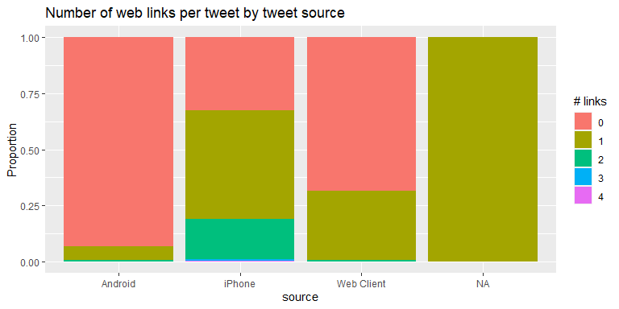
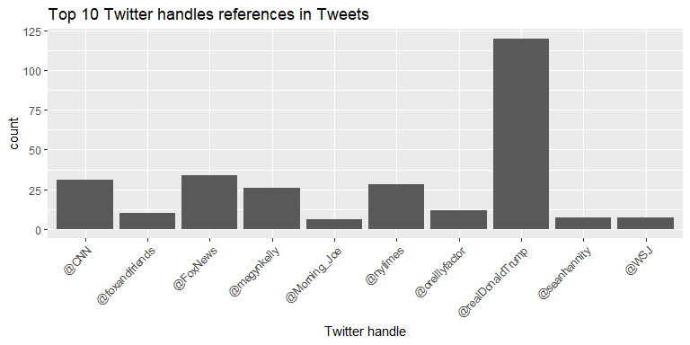
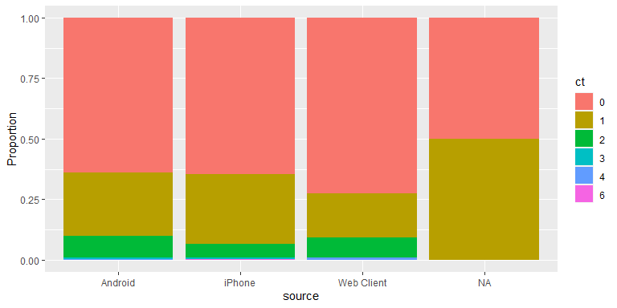

## Regular Expression Examples

#### Question 1
A Social Security number is an identifier that consists of 9 numbers. In the vector `out` below, replace all SSNs with an `XXX-XX-XXXX` string to annonymize *only* SSN data. Your algorithm should be general enough to handle non-conventional formatting of SSNs.

```r
> x <- "my SSN is 953-29-9402 and my age is 65"
> y <- "My phone number is 612-943-0539"
> z <- "my ssn number is 39502 9485."
> out <- c(x,y,z)
> out
[1] "my SSN is 953-29-9402 and my age is 65"
[2] "My phone number is 612-943-0539"       
[3] "my ssn number is 39502 9485."          
```


#### *Answer:*
Here is one way to do this. Obviously just searching for digits won't work because there is an age and phone number:

```r
> str_view_all(out,"\\d+")
```

```{=html}
<div id="htmlwidget-ae3dbd9bf318f398c553" style="width:960px;height:100%;" class="str_view html-widget"></div>
<script type="application/json" data-for="htmlwidget-ae3dbd9bf318f398c553">{"x":{"html":"<ul>\n  <li>my SSN is <span class='match'>953<\/span>-<span class='match'>29<\/span>-<span class='match'>9402<\/span> and my age is <span class='match'>65<\/span><\/li>\n  <li>My phone number is <span class='match'>612<\/span>-<span class='match'>943<\/span>-<span class='match'>0539<\/span><\/li>\n  <li>my ssn number is <span class='match'>39502<\/span> <span class='match'>9485<\/span>.<\/li>\n<\/ul>"},"evals":[],"jsHooks":[]}</script>
```
We can get the SSN with the usual format (###-##-####) with a regex that has 3, 2, and 4 digits separated by a dash. 

```r
> str_view_all(out,"(\\d){3}-(\\d){2}-(\\d){4}")
```

```{=html}
<div id="htmlwidget-356faaa20b003501ff6f" style="width:960px;height:100%;" class="str_view html-widget"></div>
<script type="application/json" data-for="htmlwidget-356faaa20b003501ff6f">{"x":{"html":"<ul>\n  <li>my SSN is <span class='match'>953-29-9402<\/span> and my age is 65<\/li>\n  <li>My phone number is 612-943-0539<\/li>\n  <li>my ssn number is 39502 9485.<\/li>\n<\/ul>"},"evals":[],"jsHooks":[]}</script>
```
This missings the oddly formatted SSN in the third entry. Rather than use a dash, we can specify the divider as `[-\\.\\s]?` which allows either 0 or 1 occurences of a dash, period or space divider:

```r
> str_view_all(out,"(\\d){3}[-\\.\\s]?(\\d){2}[-\\.\\s]?(\\d){4}")
```

```{=html}
<div id="htmlwidget-3df23d9f82fb6d1d42f6" style="width:960px;height:100%;" class="str_view html-widget"></div>
<script type="application/json" data-for="htmlwidget-3df23d9f82fb6d1d42f6">{"x":{"html":"<ul>\n  <li>my SSN is <span class='match'>953-29-9402<\/span> and my age is 65<\/li>\n  <li>My phone number is 612-943-0539<\/li>\n  <li>my ssn number is <span class='match'>39502 9485<\/span>.<\/li>\n<\/ul>"},"evals":[],"jsHooks":[]}</script>
```
Then we do a string replace with the annonymous string:

```r
> ssn <- "(\\d){3}[-\\.\\s]?(\\d){2}[-\\.\\s]?(\\d){4}"
> str_replace_all(out, ssn, "XXX-XX-XXXX")
[1] "my SSN is XXX-XX-XXXX and my age is 65"
[2] "My phone number is 612-943-0539"       
[3] "my ssn number is XXX-XX-XXXX."         
```

### Question 2
The regular expression `"^[Ss](.*)(t+)(.+)(t+)"` detects "scuttlebutt", "Stetson", and "Scattter", but not "Scatter." Why?

#### *Answer:*
We can verify the claim:

```r
> x <- c("scuttlebutt", "Stetson", "Scattter", "Scatter")
> str_detect(x, "^[Ss](.*)(t+)(.+)(t+)")
[1]  TRUE  TRUE  TRUE FALSE
```
Break it the regex down into chunks (if you don't see the answer right away). First we get the leading s or S:

```r
> str_view_all(x, "^[Ss]")
```

```{=html}
<div id="htmlwidget-cf2055f88b543fd4501f" style="width:960px;height:100%;" class="str_view html-widget"></div>
<script type="application/json" data-for="htmlwidget-cf2055f88b543fd4501f">{"x":{"html":"<ul>\n  <li><span class='match'>s<\/span>cuttlebutt<\/li>\n  <li><span class='match'>S<\/span>tetson<\/li>\n  <li><span class='match'>S<\/span>cattter<\/li>\n  <li><span class='match'>S<\/span>catter<\/li>\n<\/ul>"},"evals":[],"jsHooks":[]}</script>
```
Then we get 0 or more values to follow:

```r
> str_view_all(x, "^[Ss](.*)")
```

```{=html}
<div id="htmlwidget-1bb20253d2db9435d825" style="width:960px;height:100%;" class="str_view html-widget"></div>
<script type="application/json" data-for="htmlwidget-1bb20253d2db9435d825">{"x":{"html":"<ul>\n  <li><span class='match'>scuttlebutt<\/span><\/li>\n  <li><span class='match'>Stetson<\/span><\/li>\n  <li><span class='match'>Scattter<\/span><\/li>\n  <li><span class='match'>Scatter<\/span><\/li>\n<\/ul>"},"evals":[],"jsHooks":[]}</script>
```
Now we get S/s through 1 or more t's in the string:

```r
> str_view_all(x, "^[Ss](.*)(t+)")
```

```{=html}
<div id="htmlwidget-7c0f4c3a217ff31f4603" style="width:960px;height:100%;" class="str_view html-widget"></div>
<script type="application/json" data-for="htmlwidget-7c0f4c3a217ff31f4603">{"x":{"html":"<ul>\n  <li><span class='match'>scuttlebutt<\/span><\/li>\n  <li><span class='match'>Stet<\/span>son<\/li>\n  <li><span class='match'>Scattt<\/span>er<\/li>\n  <li><span class='match'>Scatt<\/span>er<\/li>\n<\/ul>"},"evals":[],"jsHooks":[]}</script>
```
Then we add 1 or more characters after the last t:

```r
> str_view_all(x, "^[Ss](.*)(t+)(.+)")
```

```{=html}
<div id="htmlwidget-a4129bea7e8400b5cff5" style="width:960px;height:100%;" class="str_view html-widget"></div>
<script type="application/json" data-for="htmlwidget-a4129bea7e8400b5cff5">{"x":{"html":"<ul>\n  <li><span class='match'>scuttlebutt<\/span><\/li>\n  <li><span class='match'>Stetson<\/span><\/li>\n  <li><span class='match'>Scattter<\/span><\/li>\n  <li><span class='match'>Scatter<\/span><\/li>\n<\/ul>"},"evals":[],"jsHooks":[]}</script>
```
But now we say that there must be 1 or more t's after the first "1 or more t, plus at least one other character" string. 

```r
> str_view_all(x, "^[Ss](.*)(t+)(.+)(t+)")
```

```{=html}
<div id="htmlwidget-c7386d96f385a6b3fd58" style="width:960px;height:100%;" class="str_view html-widget"></div>
<script type="application/json" data-for="htmlwidget-c7386d96f385a6b3fd58">{"x":{"html":"<ul>\n  <li><span class='match'>scuttlebutt<\/span><\/li>\n  <li><span class='match'>Stet<\/span>son<\/li>\n  <li><span class='match'>Scattt<\/span>er<\/li>\n  <li>Scatter<\/li>\n<\/ul>"},"evals":[],"jsHooks":[]}</script>
> str_detect(x, "^[Ss](.*)(t+)(.+)(t+)")
[1]  TRUE  TRUE  TRUE FALSE
```
This is what rules `scatter` out because it has two t's but there isn't an extra character between the two. Stetson only has two t's but there are characters between the two t occurences so it follows the rules. 

Finally, to get the entire word we need to end the regex with `(.*)`:

```r
> str_view_all(x, "^[Ss](.*)(t+)(.+)(t+)(.*)")
```

```{=html}
<div id="htmlwidget-25e7b5f241456130a0e6" style="width:960px;height:100%;" class="str_view html-widget"></div>
<script type="application/json" data-for="htmlwidget-25e7b5f241456130a0e6">{"x":{"html":"<ul>\n  <li><span class='match'>scuttlebutt<\/span><\/li>\n  <li><span class='match'>Stetson<\/span><\/li>\n  <li><span class='match'>Scattter<\/span><\/li>\n  <li>Scatter<\/li>\n<\/ul>"},"evals":[],"jsHooks":[]}</script>
```

## Trump Tweets


```r
> tweets<- read_csv("https://raw.githubusercontent.com/mgelman/data/master/TrumpTweetData.csv")
```

### Question 3 
a. What proportion of tweets (`text`) mention "Hillary" or "Clinton"?
b. What proportion of these tweets include "crooked"?

#### *Answer: *
a.

```r
> tw_prop <- tweets %>% 
+   select(text) %>% 
+   mutate(lower_text=str_to_lower(text),any_match=str_detect(lower_text,"hillary|clinton")) %>%
+   summarize(prop = mean(any_match)) 
```
About 17.4% of the tweets mention Hillary or Clinton.
Here we can use `str_detect` which will return a 0 or 1 based on if the `RegExp` is detected. Once we have the vector of 0 and 1s we can take the mean.

b.


```r
> tw_prop_crooked <- tweets %>% 
+   select(text) %>% 
+   mutate(lower_text=str_to_lower(text),any_match=str_detect(lower_text,"hillary|clinton")) %>%
+   filter(any_match==1) %>%
+   mutate(any_match_crooked=str_detect(lower_text,"crooked")) %>%
+   summarize(prop = mean(any_match_crooked))
```
About 54% of the tweets mentioning Hillary or Clinton included "crooked." The methodology is similar but this time we filter on the `regex` expression rather than taking the mean of the binary variable. 


### Question 4
Compute the number of web links per tweet  and compare the count distributions by tweet source. Which source has the highest proportion of web links?


#### *Answer:*
We can use the Twitter link regex provided. Then use `str_count` to count the number of occurences of this regex in each tweet. Because there are relatively few links per tweet (4 or less), I'll use a stacked bar graph to look at the tweet count distribution for each source. We see that most of the Android tweets do not contain links (about 90%) while about 70% of the iPhone tweets contain at least one link.

```r
> link <- "https://t.co/[A-Za-z\\d]+"
> tweets %>%
+   mutate(ct = as.factor(str_count(text, link))) %>%
+   ggplot(aes(x=source,fill=ct)) + 
+   geom_bar(position="fill") + 
+   scale_fill_discrete("# links") + 
+   ggtitle("Number of web links per tweet by tweet source") +
+   ylab("Proportion")
```

<!-- -->

### Question 5
Extract all Twitter handles (starting with @)  from Trump tweets. Find and graph the distribution of the 10 most used handles.  

#### *Answer:*
We will use the regexp `@[^\\s]+` (@ followed by anything that is not a space) to find Twitter handles. Here is a check:

```r
> tweets$text[50]
[1] "Thanks to @pnehlen for your kind words, very much appreciated."
> str_view(tweets$text[50], "@[^\\s]+")
```

```{=html}
<div id="htmlwidget-b9d5d1558642e15b4368" style="width:960px;height:100%;" class="str_view html-widget"></div>
<script type="application/json" data-for="htmlwidget-b9d5d1558642e15b4368">{"x":{"html":"<ul>\n  <li>Thanks to <span class='match'>@pnehlen<\/span> for your kind words, very much appreciated.<\/li>\n<\/ul>"},"evals":[],"jsHooks":[]}</script>
```
Now we extract these handles, and unlist them and make a (tbl) data frame from theis vector. Then we `group_by` the handle and count the number of occurences in the vector. Arranging and slicing off the top 10 gives us our "most popular" list which we then visualize with a simple bar graph. 

```r
> ats <- unlist(str_extract_all(tweets$text, "@[^\\s]+"))
> length(ats)
[1] 829
> data_frame(ats=ats) %>%
+   group_by(ats) %>%
+   summarize(N=n()) %>%
+   arrange(desc(N)) %>%
+   slice(1:10) %>%
+   ggplot(aes(x=ats,y=N)) +
+   geom_bar(stat="identity") + 
+   labs(title="Top 10 Twitter handles references in Tweets", x="Twitter handle",y="count") +
+   theme(axis.text.x = element_text(angle=45,hjust=1))
Warning: `data_frame()` was deprecated in tibble 1.1.0.
Please use `tibble()` instead.
```

<!-- -->

### Question 6
Repeat question 3 but look for times rather than web links. (Times are likely given when announcing an upcoming event on Twitter.)

#### *Answer:*
We can find a time with a string like `##:##`, `#:##` or any tweet with an a.m. or p.m. reference. Looks like about 40% of tweets from the Andriod or iPhone have at least one time reference while about 25% of tweets from the web client do. 


```r
> times <- "[\\d]{1,2}:[\\d]{2}|(am|pm|PM|AM|p.m|a.m|P.M|A.M)"
> tweets %>%
+   filter(str_detect(text, times)) %>%
+   select(text) %>%
+   print(width=Inf)
# A tibble: 531 × 1
   text                                                                         
   <chr>                                                                        
 1 "My economic policy speech will be carried live at 12:15 P.M. Enjoy!"        
 2 "Join me in Fayetteville, North Carolina tomorrow evening at 6pm. Tickets no…
 3 "Michael Morell, the lightweight former Acting Director of C.I.A., and a man…
 4 "Thank you Windham, New Hampshire! #TrumpPence16 #MAGA https://t.co/ZL4Q01Q4…
 5 "I am not just running against Crooked Hillary Clinton, I am running against…
 6 "Heading to New Hampshire - will be talking about Hillary saying her brain S…
 7 "Good luck #TeamUSA\r\n#OpeningCeremony #Rio2016 https://t.co/mS8qsQpJPh"    
 8 "President Obama refuses to answer question about Iran terror funding.  I wo…
 9 "Obama's disastrous judgment gave us ISIS, rise of Iran, and the worst econo…
10 "President Obama should ask the DNC about how they rigged the election again…
# … with 521 more rows
> tweets %>%
+     mutate(ct = as.factor(str_count(text, times))) %>%
+   ggplot(aes(x=source,fill=ct)) + 
+   geom_bar(position="fill") + 
+   ylab("Proportion")
```

<!-- -->
