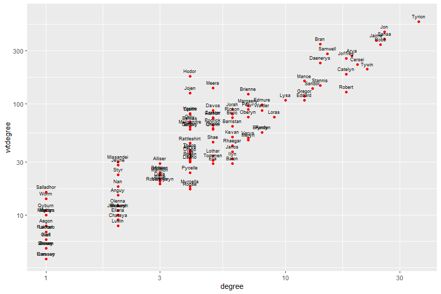
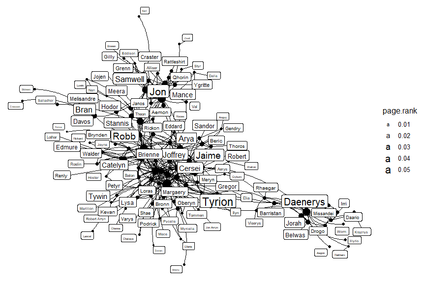
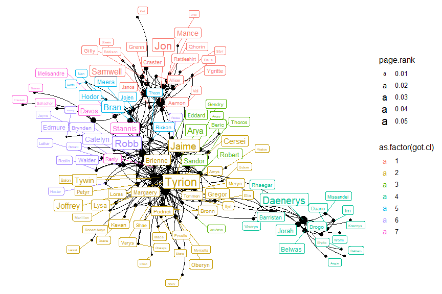

Network GoT Activity - Solution
================
ECON 122
Day 22

## Game of Thrones network

Consider the data described in the [Game of Thrones
handout](https://www.maa.org/sites/default/files/pdf/Mathhorizons/NetworkofThrones%20%281%29.pdf).
Read in the edgelist and weights from the Storm of Swords novel.

``` r
> got <- read_csv("https://raw.githubusercontent.com/mgelman/data/master/stormofswords.csv")
> got
# A tibble: 352 × 3
   Source  Target  Weight
   <chr>   <chr>    <dbl>
 1 Aemon   Grenn        5
 2 Aemon   Samwell     31
 3 Aerys   Jaime       18
 4 Aerys   Robert       6
 5 Aerys   Tyrion       5
 6 Aerys   Tywin        8
 7 Alliser Mance        5
 8 Amory   Oberyn       5
 9 Arya    Anguy       11
10 Arya    Beric       23
# … with 342 more rows
```

Two characters are connected if their names appear within 15 words of
one another in the novel. The edge weight counts the number of these
occurances. The edge list is not directed (even though the variables
names suggest such).

### Create network

The page rank algorithm is available in `igraph`. To redo the results we
see in the paper, we will use this package to create and analyze this
network. Here we create an `igraph` network object using the edge list
(the first two coloumns of `got`) along with edge variables (any columns
after cols 1-2). Note that we want the edge weights to be lower case for
`igraph` to recognize the variable as an edge weight that is used for
certain graph stat calculations.

``` r
> names(got) <- tolower(names(got))
> names(got)
[1] "source" "target" "weight"
> got.net <- graph_from_data_frame(got, directed=FALSE) 
```

The minimum number of associations between two characters is 4 and the
max is 96 (between Bran and Hodor).

``` r
> got.net
IGRAPH c6d29e2 UNW- 107 352 -- 
+ attr: name (v/c), weight (e/n)
+ edges from c6d29e2 (vertex names):
 [1] Aemon  --Grenn     Aemon  --Samwell   Aerys  --Jaime     Aerys  --Robert   
 [5] Aerys  --Tyrion    Aerys  --Tywin     Alliser--Mance     Amory  --Oberyn   
 [9] Arya   --Anguy     Arya   --Beric     Arya   --Bran      Arya   --Brynden  
[13] Arya   --Cersei    Arya   --Gendry    Arya   --Gregor    Arya   --Jaime    
[17] Arya   --Joffrey   Arya   --Jon       Arya   --Rickon    Arya   --Robert   
[21] Arya   --Roose     Arya   --Sandor    Arya   --Thoros    Arya   --Tyrion   
[25] Balon  --Loras     Belwas --Barristan Belwas --Illyrio   Beric  --Anguy    
[29] Beric  --Gendry    Beric  --Thoros    Bran   --Hodor     Bran   --Jojen    
+ ... omitted several edges
> summary(E(got.net)$weight)
   Min. 1st Qu.  Median    Mean 3rd Qu.    Max. 
   4.00    5.00    7.00   12.28   14.00   96.00 
> E(got.net)[E(got.net)$weight == 96]
+ 1/352 edge from c6d29e2 (vertex names):
[1] Bran--Hodor
```

#### Question 1

-   How many nodes (characters) are in this network? **107**
-   How many edges? What proportion of possible edges are realized?
    **352, with a density of 6.2%**
-   How many components does this network have? **there is just one
    connected component**

``` r
> ecount(got.net)
[1] 352
> vcount(got.net)
[1] 107
> is.connected(got.net)
[1] TRUE
> components(got.net)
$membership
       Aemon        Aerys      Alliser        Amory         Arya        Balon 
           1            1            1            1            1            1 
      Belwas        Beric         Bran      Brienne        Bronn      Brynden 
           1            1            1            1            1            1 
     Catelyn       Cersei      Craster       Daario     Daenerys        Davos 
           1            1            1            1            1            1 
      Eddard      Eddison       Edmure       Gendry        Gilly       Gregor 
           1            1            1            1            1            1 
       Hodor       Hoster         Irri        Jaime        Janos      Joffrey 
           1            1            1            1            1            1 
       Jojen          Jon    Jon Arryn        Jorah        Kevan        Loras 
           1            1            1            1            1            1 
      Lothar        Luwin         Lysa        Mance        Meera   Melisandre 
           1            1            1            1            1            1 
       Meryn    Missandei     Myrcella       Oberyn      Podrick  Rattleshirt 
           1            1            1            1            1            1 
       Renly      Rhaegar      Rickard       Rickon         Robb       Robert 
           1            1            1            1            1            1 
Robert Arryn        Roose      Samwell       Sandor        Sansa         Shae 
           1            1            1            1            1            1 
     Shireen      Stannis       Tommen       Tyrion        Tywin          Val 
           1            1            1            1            1            1 
       Varys      Viserys       Walder       Walton      Ygritte        Grenn 
           1            1            1            1            1            1 
       Anguy       Thoros    Barristan      Illyrio          Nan        Theon 
           1            1            1            1            1            1 
       Jeyne        Petyr       Roslin         Elia         Ilyn      Pycelle 
           1            1            1            1            1            1 
        Karl        Drogo        Aegon      Kraznys      Rakharo         Worm 
           1            1            1            1            1            1 
     Cressen    Salladhor       Qyburn        Bowen     Margaery        Dalla 
           1            1            1            1            1            1 
       Orell       Qhorin         Styr       Lancel       Olenna    Marillion 
           1            1            1            1            1            1 
     Ellaria         Mace       Ramsay      Chataya        Doran 
           1            1            1            1            1 

$csize
[1] 107

$no
[1] 1
> graph.density(got.net)
[1] 0.06207018
```

### Centrality stats: Degree

Let’s next look at the centrality stats for characters in the network.
In case you have the `statnet` package loaded, the stats below with
names in common specifically reference the `igraph` package.

Node degree counts the number of characters that a given node is
associated with. The weighted degree (given by `graph.strength`) is the
sum of the edge weights for edges connecting a node to other characters.
This weighted degree counts the total number of interactions a character
has with others in the network. Here we compute the degrees and create a
data frame of them:

``` r
> V(got.net)$degree <- igraph::degree(got.net)
> V(got.net)$wtdegree <- graph.strength(got.net)
> stats <- data_frame(name = V(got.net)$name, 
+                     degree = V(got.net)$degree, 
+                     wtdegree = V(got.net)$wtdegree )
Warning: `data_frame()` was deprecated in tibble 1.1.0.
Please use `tibble()` instead.
```

#### Question 2

-   Who are the five characters with highest degree? Highest weighted
    degree? Verify that these values (look like they) match those in
    Figure 3 of the GoT paper.  
-   Explain how Robb can have higher degree than Bran but lower weighted
    degree.

**answer** The highest degree and weighted degree include Tyrion, Jon,
Sansa and Jamie. Robb has a higher ranked degree (4th) than Bran
(\>10th), but Bran has a higher weighted degree (5th vs 6th). This means
that Bran interacts with fewer people (less degree), but when he does
interact with other character(s) he has many interaction instances.
Basically, Bran is in the book a lot but he interacts with fewer people
than Robb.

``` r
> stats %>% arrange(desc(degree))
# A tibble: 107 × 3
   name    degree wtdegree
   <chr>    <dbl>    <dbl>
 1 Tyrion      36      551
 2 Jon         26      442
 3 Sansa       26      383
 4 Robb        25      342
 5 Jaime       24      372
 6 Tywin       22      204
 7 Cersei      20      226
 8 Arya        19      269
 9 Catelyn     18      184
10 Joffrey     18      255
# … with 97 more rows
> stats %>% arrange(desc(wtdegree))
# A tibble: 107 × 3
   name     degree wtdegree
   <chr>     <dbl>    <dbl>
 1 Tyrion       36      551
 2 Jon          26      442
 3 Sansa        26      383
 4 Jaime        24      372
 5 Bran         14      344
 6 Robb         25      342
 7 Samwell      15      282
 8 Arya         19      269
 9 Joffrey      18      255
10 Daenerys     14      232
# … with 97 more rows
> ggplot(stats, aes(x=degree, y=wtdegree)) + 
+   geom_point(color="red") + 
+   geom_text(aes(label=name), size=2.5, nudge_y = .05) + 
+   scale_x_log10() + 
+   scale_y_log10()
```

<!-- -->

### Centrality stats: Betweenness and closeness

Here are the unweighted versions of betweenness and closeness. Note that
the “conventional” closeness measure is the inverse of the mean shortest
path distance between a node and all other nodes in the network, so that
larger values (closer to 1) indicate a higher level of closeness. The
GoT paper computes the inverse of this (i.e. mean path distance), so
that lower values (closer to 1) indicate a higher level of closeness.

``` r
> V(got.net)$betweenness <- igraph::betweenness(got.net, weights=NA)
> V(got.net)$closeness <- igraph::closeness(got.net, normalized = TRUE, weights=NA)
> V(got.net)$inv.closeness <- 1/V(got.net)$closeness
```

#### Question 3

-   Add these stats to the `stats` data frame created above. Verify that
    the top ranked characters match those shown in Figure 3
-   How can a character link Daenerys have a low rank for closeness but
    a much higher rank for betweenness. (You can use Figure 2 in the GoT
    paper to visualize the structure.)

**answer:** She interacts primarily with a small group of individuals
and is a far distance (path) to others in the novel, but she is also
acts to connect these individuals to the wider network of characters
(hence the high betweenness).

``` r
> stats <- stats %>% 
+   mutate(betweenness = V(got.net)$betweenness,
+          closeness = V(got.net)$closeness, 
+          inv.closeness =  V(got.net)$inv.closeness )
> stats %>% arrange(desc(betweenness))
# A tibble: 107 × 6
   name     degree wtdegree betweenness closeness inv.closeness
   <chr>     <dbl>    <dbl>       <dbl>     <dbl>         <dbl>
 1 Jon          26      442       1280.     0.480          2.08
 2 Robert       18      128       1166.     0.5            2   
 3 Tyrion       36      551       1101.     0.512          1.95
 4 Daenerys     14      232        875.     0.366          2.74
 5 Robb         25      342        707.     0.488          2.05
 6 Sansa        26      383        705.     0.510          1.96
 7 Stannis      14      146        572.     0.480          2.08
 8 Jaime        24      372        556.     0.480          2.08
 9 Arya         19      269        443.     0.486          2.06
10 Tywin        22      204        365.     0.469          2.13
# … with 97 more rows
> stats %>% arrange(inv.closeness)
# A tibble: 107 × 6
   name    degree wtdegree betweenness closeness inv.closeness
   <chr>    <dbl>    <dbl>       <dbl>     <dbl>         <dbl>
 1 Tyrion      36      551       1101.     0.512          1.95
 2 Sansa       26      383        705.     0.510          1.96
 3 Robert      18      128       1166.     0.5            2   
 4 Robb        25      342        707.     0.488          2.05
 5 Arya        19      269        443.     0.486          2.06
 6 Jaime       24      372        556.     0.480          2.08
 7 Jon         26      442       1280.     0.480          2.08
 8 Stannis     14      146        572.     0.480          2.08
 9 Tywin       22      204        365.     0.469          2.13
10 Eddard      12      108        108.     0.461          2.17
# … with 97 more rows
```

### Centrality stats: Google page rank

The GoT gives a simple description of the page rank centrality measure.
The basic idea is that a node will have a higher page rank value (and
higher “centrality”) if it is connected to important nodes. The page
rank of node `i` is a function of the weighted sum of the page ranks of
its neighbors (who `i` is connected to) with weights given by the edge
weight between node `i` and its neighbor divided by the total weighted
degree of the neighbor.

For example, consider the page ranks of Catelyn and Hodor. Both are
connected to Bran, who has a weighted degree of 344. Bran has a total of
4 interactions with Catelyn so his page rank value is weighted by the
fraction 4/344, or 0.01, when computing Catelyn’s page rank. But Hodor’s
page rank calculation is influenced much more by Bran’s value, since he
has 96 interactions with Bran, which makes up a 96/344, or 0.28,
fraction of all of Bran’s interactions. In this way, Hodor’s page rank
will be closer to Bran’s value because he has more interactions with him
than Catelyn.

#### Question 4

-   Compute the page rank values below, then add them to the `stats`
    data frame.
-   Verify that the characters with the top 6 page rank value are the
    same set (but in a different order) as the top 6 in Figure 3.
-   How can Daenerys have such a high page rank but low degree?

**answer:** This answer is similar to the one given in question 3.
Basically, she gets all or most of the page rank influence of her close
circle of friends, since she is their sole or majority weight connection
in the network. Other characters, like Robb, may have higher degree or
weighted degree, but their associates also have a high degree so the
*proportion* of their page rank that goes to Robb is small.

-   Plot the network with node or label size determined by the page rank
    value.

``` r
> V(got.net)$page.rank <- page_rank(got.net)$vector
```

``` r
> stats <- stats %>% 
+   mutate(page.rank = V(got.net)$page.rank)
> stats %>% arrange(desc(page.rank))
# A tibble: 107 × 7
   name     degree wtdegree betweenness closeness inv.closeness page.rank
   <chr>     <dbl>    <dbl>       <dbl>     <dbl>         <dbl>     <dbl>
 1 Tyrion       36      551       1101.     0.512          1.95    0.0555
 2 Jon          26      442       1280.     0.480          2.08    0.0449
 3 Daenerys     14      232        875.     0.366          2.74    0.0410
 4 Jaime        24      372        556.     0.480          2.08    0.0366
 5 Sansa        26      383        705.     0.510          1.96    0.0364
 6 Robb         25      342        707.     0.488          2.05    0.0341
 7 Bran         14      344        351.     0.421          2.38    0.0290
 8 Samwell      15      282        180.     0.384          2.60    0.0283
 9 Arya         19      269        443.     0.486          2.06    0.0255
10 Joffrey      18      255        142.     0.440          2.27    0.0242
# … with 97 more rows
```

``` r
> set.seed(1)
> ggplot(ggnetwork(got.net ), aes(x=x,y=y,xend=xend,yend=yend)) + 
+   geom_nodes(aes(size=page.rank)) + 
+   geom_edges(curvature = .2) + 
+   theme_blank() +
+   geom_nodelabel_repel(aes(label=name,size=page.rank),box.padding = 0,force=20)
Warning: ggrepel: 1 unlabeled data points (too many overlaps). Consider
increasing max.overlaps
```

<!-- -->

### Community detection

Community detection in networks is a process of finding clusters
(communities) of nodes that are highly connected within a cluster and
have few connections across clusters. Figure 2 in the GoT uses color to
denote the 7 communities found in their analysis.

There are a variety of algorithms to do this, but most depend on the
modularity of the cluster assignment. Modularity compares the weight
between two nodes in the same cluster to the expected weight between the
two nodes under a random assignment of edges. The higher the modularity
value, the higher the level of clustering (with a max value of 1).

The GoT mentions uses the Louvain algorithm, which is a hierarchical
method similar to hierarchical clustering for unsupervised learning.
Nodes start out as individual clusters, then are merged together to
create communities to increase modularity the most at each step (in a
local, greedy way). The algorithm stops when modularity can’t be
increased by an additional step.

``` r
> got.cl <- cluster_louvain(got.net)
> got.cl
IGRAPH clustering multi level, groups: 7, mod: 0.6
+ groups:
  $`1`
   [1] "Aemon"       "Alliser"     "Craster"     "Eddison"     "Gilly"      
   [6] "Janos"       "Jon"         "Mance"       "Rattleshirt" "Samwell"    
  [11] "Val"         "Ygritte"     "Grenn"       "Karl"        "Bowen"      
  [16] "Dalla"       "Orell"       "Qhorin"      "Styr"       
  
  $`2`
   [1] "Aerys"        "Amory"        "Balon"        "Brienne"     
   [5] "Bronn"        "Cersei"       "Gregor"       "Jaime"       
   [9] "Joffrey"      "Kevan"        "Loras"        "Lysa"        
  + ... omitted several groups/vertices
> modularity(got.cl)
[1] 0.5979838
> table(membership(got.cl))

 1  2  3  4  5  6  7 
19 37  9 15  8 12  7 
> V(got.net)$got.cl <- membership(got.cl)
```

``` r
> set.seed(1)
> ggplot(ggnetwork(got.net ), aes(x=x,y=y,xend=xend,yend=yend)) + 
+   geom_nodes(aes(size=page.rank)) + 
+   geom_edges(curvature = .2) + 
+   theme_blank() + 
+   geom_nodelabel_repel(aes(label=name,size=page.rank,color=as.factor(got.cl)),box.padding = 0,force=30)
Warning: ggrepel: 1 unlabeled data points (too many overlaps). Consider
increasing max.overlaps
```

<!-- -->

#### Question 5

-   Verify that the Louvian function above gives us 7 communities that
    seem to match those in GoT Figure 2.
-   What is the value of modularity for the community memberships found
    by the Louvian algorithm? **about .6**

### Random networks

Is the value of modularity in question 5 large? What values would be
expected from a graph with 107 nodes and 352 edges if the edges were
randomly assigned with no clustering or communities?

The `erdos.renyi.game` function can create such a network. Here we
assign the number of nodes and edges, then edges are randomly assigned
to pairs of nodes (with no direction, no loops, no multiple edges
between nodes).

``` r
> test <- erdos.renyi.game(vcount(got.net), ecount(got.net), type="gnm")
> plot(test)
```

<!-- -->
Then we assign the edge weights to the random network’s 352 edges. Now
we have a network with the same number of nodes, edges, edge weights,
and density as the GoT network.

#### Question 6

-   How many clusters were found in this random network?
-   What is the modularity of this random network’s clusters? Is the GoT
    network’s modularity higher? **the GoT modularity should be higher**

``` r
> E(test)$weight <- got$weight
> test.cl <- cluster_louvain(test)
> modularity(test.cl)
[1] 0.5225017
> table(membership(test.cl))

 1  2  3  4  5  6  7  8  9 10 
13  8 10 21 14 12 11  8  4  6 
```

To help assess how different the GoT’s modularity is compared to the
random network’s, we could create lots of random networks (with the same
basic network structure), fit the cluster algorithm and compute their
modularity. If the GoT’s modularity is higher than these values, we
could claim that the observed GoT modularity is higher than what we’d
expect in a random graph with similar basic structure.

Here is a function that creates one random network with the right
structure. The output is the modularity of the Louvian cluster choice:

``` r
> sim <- function(net)
+ {
+   test.sim <- erdos.renyi.game(vcount(net), ecount(net), type="gnm")
+   E(test.sim)$weight = E(net)$weight
+   modularity(cluster_louvain(test.sim))
+ }
```

Then repeat this 1000 times:

``` r
> mods <- replicate(1000,sim(got.net))
```

Compare the GoT network’s modularity to the simuluated values:

``` r
> hist(mods, xlim=c(.45,.65))
> abline(v=modularity(got.cl))
```

<!-- -->

#### Question 7

-   How does the GoT modularity compare to the simulated ones? What does
    this suggest about the communities found in the GoT network? **The
    modularity is much higher than even the highest possible modularity
    in the random networks This implies that the communiuties in the GoT
    network are quite strong and not just a fluke of the algorithm. We
    already knew the communities make sense if we’ve read the book but
    this is a quantitative confirmation of that fact **
