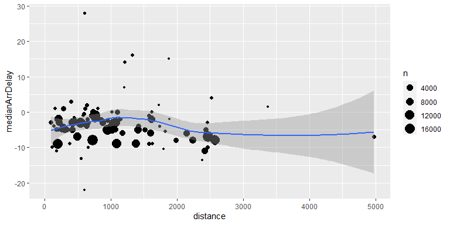
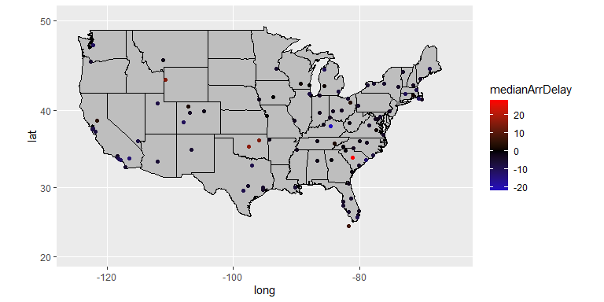
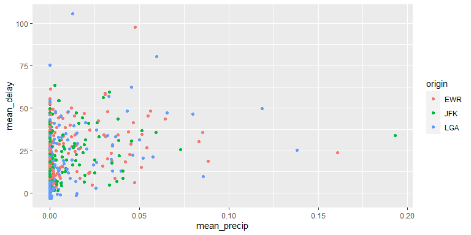

Data wrangling: multiple data table - Solution
================
ECON 122
Day 7

Package versions used:

``` r
> mypacks
[1] "ggplot2"      "dplyr"        "nycflights13"
> lapply(mypacks, packageVersion)
[[1]]
[1] '3.3.5'

[[2]]
[1] '1.0.7'

[[3]]
[1] '1.0.2'
```

## `nycflights13` package

The `nycflights13` package contains multiple data sets describing
`flights` departing from NYC area in 2013, along with info on
`airlines`, `airports`, `planes` and `weather` in 2013.

#### 1. Take a look at the `flights` `airlines` and `airports` data set help files.

-   What variable(s) are the keys that connect the `flights` and
    `airlines` data sets?

*answers:* `flights` variable `carrier` matches with `airlines` variable
`carrier`.

-   What variable(s) are the keys that connect the `flights` and
    `airports` data sets?

*answers:* `flights` variables `origin` and `dest` both connect to
`airports` variable `faa`

#### 2. Use the `airports` data set to add the destination airport information to the `flights` data.

-   How many unique flight destintations in `flights` are not given in
    the `airports` data? (Hint: look at `anti_join` or `semi_join`)

*answer:* `anti_join(x,y)` is a filtering join, it returns rows of `x`
that are not matched in `y`. There are over 7,000 flights in the
`anti_join` command, but that doesn’t tell us how many unique
destinations they have. After selecting the `dest` variable, the
`distinct()` command tells us that there are just 4 destinations in
`flights` that are not in `airports`.

``` r
> anti_join(flights, airports, by=c("dest"="faa")) %>% select(dest) %>% distinct()
# A tibble: 4 x 1
  dest 
  <chr>
1 BQN  
2 SJU  
3 STT  
4 PSE  
```

-   How many airports given in `airports` are not destinations given in
    `flights`?

*answer:* there are 1357 airports in `airports` that are not
destinations in `flights`. Since each row in `airports` is a distinct
location (which you can verify with a `distinct` command), we don’t
actually need to check for unique locations like we did for the flights
data.

``` r
> anti_join(airports, flights, by=c("faa"="dest")) 
# A tibble: 1,357 x 8
   faa   name                             lat    lon   alt    tz dst   tzone    
   <chr> <chr>                          <dbl>  <dbl> <dbl> <dbl> <chr> <chr>    
 1 04G   Lansdowne Airport               41.1  -80.6  1044    -5 A     America/~
 2 06A   Moton Field Municipal Airport   32.5  -85.7   264    -6 A     America/~
 3 06C   Schaumburg Regional             42.0  -88.1   801    -6 A     America/~
 4 06N   Randall Airport                 41.4  -74.4   523    -5 A     America/~
 5 09J   Jekyll Island Airport           31.1  -81.4    11    -5 A     America/~
 6 0A9   Elizabethton Municipal Airport  36.4  -82.2  1593    -5 A     America/~
 7 0G6   Williams County Airport         41.5  -84.5   730    -5 A     America/~
 8 0G7   Finger Lakes Regional Airport   42.9  -76.8   492    -5 A     America/~
 9 0P2   Shoestring Aviation Airfield    39.8  -76.6  1000    -5 U     America/~
10 0S9   Jefferson County Intl           48.1 -123.    108    -8 A     America/~
# ... with 1,347 more rows
```

-   Use `left_join` to add `airports` info to the `flights` data. How
    many rows are in this joined data? Then repeat using `inner_join`
    and `full_join`. Explain the differences in row counts for these
    three ways of joining.

*answers:* Use a `left_join` to add destination names to the `flights`
data gives 336776 rows. With `inner` we get 329174 and with `full` we
get 338133.

The `left` join preserves the length of the `flights` data, and puts
`NA`’s in for locations of the four destinations that are not in
`airports`. The `inner` join only contains the `dest` that are in
`airports`, so this is the smallest of the three joins. The `full` joins
includes all possible `airports` and `dest` locations and fills in
`NA`’s whenever a `dest` location is unknown, or a `airport` was not one
of the flights destinations.

``` r
> (flights_dest<- left_join(flights,airports, by=c("dest"="faa")) )  
# A tibble: 336,776 x 26
    year month   day dep_time sched_dep_time dep_delay arr_time sched_arr_time
   <int> <int> <int>    <int>          <int>     <dbl>    <int>          <int>
 1  2013     1     1      517            515         2      830            819
 2  2013     1     1      533            529         4      850            830
 3  2013     1     1      542            540         2      923            850
 4  2013     1     1      544            545        -1     1004           1022
 5  2013     1     1      554            600        -6      812            837
 6  2013     1     1      554            558        -4      740            728
 7  2013     1     1      555            600        -5      913            854
 8  2013     1     1      557            600        -3      709            723
 9  2013     1     1      557            600        -3      838            846
10  2013     1     1      558            600        -2      753            745
# ... with 336,766 more rows, and 18 more variables: arr_delay <dbl>,
#   carrier <chr>, flight <int>, tailnum <chr>, origin <chr>, dest <chr>,
#   air_time <dbl>, distance <dbl>, hour <dbl>, minute <dbl>, time_hour <dttm>,
#   name <chr>, lat <dbl>, lon <dbl>, alt <dbl>, tz <dbl>, dst <chr>,
#   tzone <chr>
> inner_join(flights,airports, by=c("dest"="faa")) 
# A tibble: 329,174 x 26
    year month   day dep_time sched_dep_time dep_delay arr_time sched_arr_time
   <int> <int> <int>    <int>          <int>     <dbl>    <int>          <int>
 1  2013     1     1      517            515         2      830            819
 2  2013     1     1      533            529         4      850            830
 3  2013     1     1      542            540         2      923            850
 4  2013     1     1      554            600        -6      812            837
 5  2013     1     1      554            558        -4      740            728
 6  2013     1     1      555            600        -5      913            854
 7  2013     1     1      557            600        -3      709            723
 8  2013     1     1      557            600        -3      838            846
 9  2013     1     1      558            600        -2      753            745
10  2013     1     1      558            600        -2      849            851
# ... with 329,164 more rows, and 18 more variables: arr_delay <dbl>,
#   carrier <chr>, flight <int>, tailnum <chr>, origin <chr>, dest <chr>,
#   air_time <dbl>, distance <dbl>, hour <dbl>, minute <dbl>, time_hour <dttm>,
#   name <chr>, lat <dbl>, lon <dbl>, alt <dbl>, tz <dbl>, dst <chr>,
#   tzone <chr>
> full_join(flights,airports, by=c("dest"="faa")) 
# A tibble: 338,133 x 26
    year month   day dep_time sched_dep_time dep_delay arr_time sched_arr_time
   <int> <int> <int>    <int>          <int>     <dbl>    <int>          <int>
 1  2013     1     1      517            515         2      830            819
 2  2013     1     1      533            529         4      850            830
 3  2013     1     1      542            540         2      923            850
 4  2013     1     1      544            545        -1     1004           1022
 5  2013     1     1      554            600        -6      812            837
 6  2013     1     1      554            558        -4      740            728
 7  2013     1     1      555            600        -5      913            854
 8  2013     1     1      557            600        -3      709            723
 9  2013     1     1      557            600        -3      838            846
10  2013     1     1      558            600        -2      753            745
# ... with 338,123 more rows, and 18 more variables: arr_delay <dbl>,
#   carrier <chr>, flight <int>, tailnum <chr>, origin <chr>, dest <chr>,
#   air_time <dbl>, distance <dbl>, hour <dbl>, minute <dbl>, time_hour <dttm>,
#   name <chr>, lat <dbl>, lon <dbl>, alt <dbl>, tz <dbl>, dst <chr>,
#   tzone <chr>
> nrow(flights)
[1] 336776
```

-   Calcuate the median `arr_delay`, average flight `distance`, and
    number of flights for each destination. Plot mean distance vs mean
    arrival delay, using number of flights to determine point size.
    Describe the trend you see.

*answer:* Median arrival delay increases slightly until 1000 miles, then
descreases. There are some outlier cases, but these look to be
destinations with relatively few flights in a year. For example, the
very low arrival delay (less than -20, meaning it arrived ahead of
schedule) was one flight to `LEX`.

``` r
> flights_dest %>% 
+   group_by(dest) %>% 
+   summarize(medianArrDelay = median(arr_delay, na.rm=TRUE),
+             distance = mean(distance, na.rm=TRUE), 
+             n=n()) %>%
+   ggplot(aes(x=distance, y=medianArrDelay)) + 
+     geom_point(aes(size=n)) + 
+     geom_smooth() 
Warning: Removed 1 rows containing non-finite values (stat_smooth).
Warning: Removed 1 rows containing missing values (geom_point).
```

<!-- -->

``` r
> flights_dest %>% 
+   group_by(dest) %>% 
+   summarize(medianArrDelay = median(arr_delay, na.rm=TRUE),
+             distance = mean(distance, na.rm=TRUE), 
+             n=n()) %>% 
+   filter(medianArrDelay < -20)
# A tibble: 1 x 4
  dest  medianArrDelay distance     n
  <chr>          <dbl>    <dbl> <int>
1 LEX              -22      604     1
```

**Counting Comment:** The `n()` command above will count rows (flights)
to each `dest` (grouping) even if it is missing a distance or arrival
delay measurement. If we only wanted to “count” valid rows will data for
each, we should add a `filter(!is.na(arr_delay), !is.na(distance))`
before summarizing the data.

-   For fun: Use median arrival delay by destination to map mean delay
    by location on a map of the US. You can filter `lat` and `long` to
    restrict attention to the main 48 states.

*answer:* Take care with how layers are added. The polygon fill needs to
happen before the points are laid on top. The `filter` command is used
(in addition to the `scale` commands) to make sure that Alaska and
Hawaii times aren’t included in the color scaling of median arrival
delay times.

``` r
> states <- map_data("state")
> flights_dest %>% 
+   group_by(dest) %>%   
+   summarize(medianArrDelay = median(arr_delay, na.rm=TRUE), 
+             long=first(lon),
+             lat=first(lat)) %>%
+   filter(between(long, -125,-65), between(lat, 20,50)) %>%
+   ggplot(aes(x=long,y=lat)) + 
+     geom_polygon(data=states, aes(x=long, y=lat, group=group), fill="gray",color="black") + 
+     geom_point(aes(color=medianArrDelay)) +  
+     coord_map() + 
+     scale_x_continuous(limits = c(-125,-65)) + 
+     scale_y_continuous(limits = c(20,50)) + 
+     scale_color_gradient2(midpoint=0,low="blue",high="red",mid="black")
```

<!-- -->

#### 3. Use the `weather` data set to add hourly weather information to the `flights` data.

-   The `flights` data contains `hour` and `minute` variables. Do these
    record the departure, scheduled departure, arrival or schedule
    arrival time?

*answers:* scheduled departure time, this is the time to use to join
with weather data

``` r
> flights %>% select(hour,minute,sched_dep_time,dep_time)
# A tibble: 336,776 x 4
    hour minute sched_dep_time dep_time
   <dbl>  <dbl>          <int>    <int>
 1     5     15            515      517
 2     5     29            529      533
 3     5     40            540      542
 4     5     45            545      544
 5     6      0            600      554
 6     5     58            558      554
 7     6      0            600      555
 8     6      0            600      557
 9     6      0            600      557
10     6      0            600      558
# ... with 336,766 more rows
```

-   What variables are the keys to connect `flights` and `weather`?

*answers:* The `month`,`day`, `hour` and `origin` variables.

#### 4. Use the `weather` data set to add the hourly weather information to the `flights` data.

-   Plot the daily average departure delay vs. the daily average precip,
    using colors to represent origin. Describe the relationship you
    observe.

*answers:* As expected, we observe a positive relationship between
average precipitation and departure delay.

``` r
> flights_weather<- left_join(flights,nycflights13::weather,by=c("month","day","hour","origin")) 
> flights_weather %>% select(month,day,hour,precip) 
# A tibble: 336,776 x 4
   month   day  hour precip
   <int> <int> <dbl>  <dbl>
 1     1     1     5      0
 2     1     1     5      0
 3     1     1     5      0
 4     1     1     5      0
 5     1     1     6      0
 6     1     1     5      0
 7     1     1     6      0
 8     1     1     6      0
 9     1     1     6      0
10     1     1     6      0
# ... with 336,766 more rows
> flights_weather %>% 
+   group_by(month,day,origin) %>% 
+   summarize(mean_precip=mean(precip,na.rm=TRUE), mean_delay=mean(dep_delay,na.rm=TRUE)) %>% 
+   ggplot(aes(x=mean_precip,y=mean_delay)) + 
+       geom_point(aes(color=origin)) 
Warning: Removed 3 rows containing missing values (geom_point).
```

<!-- -->
